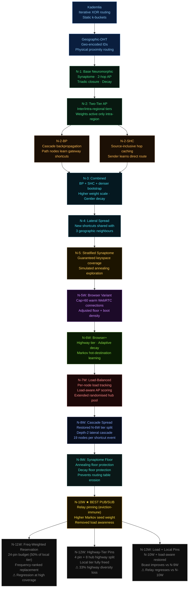

```mermaid
flowchart TB
    subgraph P1["Phase 1 · Bootstrap"]
        direction LR
        B1["Build XOR routing table\nk nearest peers per stratum\nInitial synaptome"]
    end
    subgraph P2["Phase 2 · Action Selection"]
        direction LR
        B2["Two-hop lookahead AP\nGreedy forward routing\nε=5% random exploration"]
    end
    subgraph P3["Phase 3 · LTP Reinforcement"]
        direction LR
        B3["On success: wave backward\nweight += 0.2 per used synapse\nDecay-immune for 20 epochs"]
    end
    subgraph P4["Phase 4 · Structural Plasticity"]
        direction LR
        B4A["Triadic closure\nfrequent relay pairs introduced"]
        B4B["Hop caching\nshortcuts injected to traversed targets"]
    end
    subgraph P5["Phase 5 · LTD Decay"]
        direction LR
        B5["Every 100 lookups\nweight × DECAY_GAMMA\nPrune below threshold"]
    end
    P1 --> P2 --> P3 --> P4 --> P5
    P5 -->|"next lookup"| P2

    style P1 fill:#040e1c,stroke:#2a5ea0
    style P2 fill:#040e1c,stroke:#226040
    style P3 fill:#040e1c,stroke:#226040
    style P4 fill:#040e1c,stroke:#5a3a18
    style P5 fill:#040e1c,stroke:#1a4a60
```

# DHT Globe Simulator

An interactive 3-D globe simulator for studying and comparing distributed hash table routing protocols, from classical Kademlia to a family of thirteen neuromorphic protocols that learn and adapt their routing tables through simulated synaptic plasticity — including eight browser-realistic variants engineered for real-world WebRTC deployment. The most advanced variant, N-10W, introduces eviction-immune relay pinning and is the current best-performing protocol for pub/sub overlay networks.

The simulator renders a live WebGL globe of up to 100,000 nodes distributed according to real-world population density, routes messages between them in real time, and benchmarks every protocol side by side — measuring hop counts, latency, churn resilience, regional performance, load distribution, and learning convergence over time.

---

## Quick Start

```bash
git clone https://github.com/YZ-social/dht-sim.git
cd dht-sim
npm install
npm start          # starts static server on http://localhost:3000
```

Open `http://localhost:3000` in a modern browser. No build step required — the project uses native ES modules.

---

## System Architecture

```
┌────────────────────────────────────────────────────────────────────┐
│  Browser  (index.html + ES modules, no bundler)                    │
│                                                                    │
│  ┌─────────────┐   ┌──────────────┐   ┌──────────────────────────┐ │
│  │  Controls   │   │    Main      │   │       Results            │ │
│  │  (UI strip) │──▶│ (orchestrat) │──▶│  (charts + table + CSV)  │ │
│  └─────────────┘   └──────┬───────┘   └──────────────────────────┘ │
│                           │                                        │
│              ┌────────────┼─────────────┐                          │
│              ▼            ▼             ▼                          │
│  ┌──────────────┐  ┌──────────┐  ┌───────────────┐                │
│  │  Globe.js    │  │ Engine   │  │  DHT Protocol │                │
│  │  (Three.js   │  │ (test    │  │  (one of 14   │                │
│  │   WebGL)     │  │  runner) │  │   protocols)  │                │
│  └──────────────┘  └──────────┘  └───────────────┘                │
│                                                                    │
│  ┌─────────────────────────────────────────────────────────────┐   │
│  │   Protocol family                                           │   │
│  │   Kademlia · Geographic                                     │   │
│  │   N-1 · N-2 · N-2-BP · N-2-SHC · N-3 · N-4 · N-5          │   │
│  │   N-5W · N-6W · N-7W · N-8W · N-9W                         │   │
│  │   N-10W ★ · N-11W · N-12W · N-13W                          │   │
│  └─────────────────────────────────────────────────────────────┘   │
└────────────────────────────────────────────────────────────────────┘
         ▲
  node server.js  (express static server, port 3000)
```

### Key source files

| Path | Role |
|---|---|
| `index.html` | Shell, control strip HTML, results overlay HTML |
| `style.css` | All styling (dark theme, uniform control groups, chart panels) |
| `src/main.js` | Orchestrator — wires controls → engine → globe → results |
| `src/simulation/Engine.js` | Test runner (lookup, churn, benchmark, concordance, pairs, hotspot) |
| `src/ui/Controls.js` | Control strip read/write, button state machine |
| `src/ui/Results.js` | Chart.js rendering, Lorenz curves, CSV export, panel management |
| `src/globe/Globe.js` | Three.js globe, node dots, path arcs, country borders |
| `src/dht/kademlia/KademliaDHT.js` | Kademlia implementation |
| `src/dht/geographic/GeographicDHT.js` | Geographic-DHT (geo-encoded IDs) |
| `src/dht/neuromorphic/NeuromorphicDHT.js` | N-1 base neuromorphic |
| `src/dht/neuromorphic/NeuromorphicDHT2.js` | N-2 two-tier hierarchical |
| `src/dht/neuromorphic/NeuromorphicDHT2BP.js` | N-2-BP + cascade backpropagation |
| `src/dht/neuromorphic/NeuromorphicDHT2SHC.js` | N-2-SHC + source hop caching |
| `src/dht/neuromorphic/NeuromorphicDHT3.js` | N-3 combined + dense bootstrap |
| `src/dht/neuromorphic/NeuromorphicDHT4.js` | N-4 + lateral shortcut propagation |
| `src/dht/neuromorphic/NeuromorphicDHT5.js` | N-5 + stratified synaptome + annealing |
| `src/dht/neuromorphic/NeuromorphicDHT5W.js` | N-5W browser-realistic variant (cap=60) |
| `src/dht/neuromorphic/NeuromorphicDHT6W.js` | N-6W + highway tier + adaptive decay + Markov |
| `src/dht/neuromorphic/NeuromorphicDHT7W.js` | N-7W + load-aware routing + extended hub pool |
| `src/dht/neuromorphic/NeuromorphicDHT8W.js` | N-8W + cascading lateral spread + tier rebalancing |
| `src/dht/neuromorphic/NeuromorphicDHT9W.js` | N-9W + synaptome floor protection |
| `src/dht/neuromorphic/NeuromorphicDHT10W.js` | N-10W ★ + relay pinning (current best pub/sub) |
| `src/dht/neuromorphic/NeuromorphicDHT11W.js` | N-11W + frequency-weighted reservation (experimental) |
| `src/dht/neuromorphic/NeuromorphicDHT12W.js` | N-12W + highway-tier relay pinning (experimental) |
| `src/dht/neuromorphic/NeuromorphicDHT13W.js` | N-13W + load awareness + local pins (experimental) |
| `src/dht/neuromorphic/NeuronNode.js` | Per-node state: synaptome, transit cache |
| `src/dht/neuromorphic/Synapse.js` | Synapse data model (weight, latency, stratum, useCount) |
| `src/utils/geo.js` | Great-circle distance, latency model, population sampling, XOR routing table |
| `src/utils/s2.js` | S2 cell encoding for geographic IDs |

---

## Routing Foundation: The XOR Keyspace

Every node in every protocol is assigned a **G-ID** (Geographic Identifier). The default keyspace is **64 bits** (configurable to 8, 16, 32, 64, or 128 bits). The routing distance between any two nodes is their XOR:

```
distance(A, B) = A.id XOR B.id
```

XOR distance is symmetric, satisfies the triangle inequality, and partitions the keyspace into a binary tree. The **stratum** of a peer is the number of matching leading bits:

```
stratum = clz64(A.id XOR B.id)   // 0 = far, 63 = very close

Stratum  0: nodes differ in bit 63 — opposite ends of keyspace (~10,000 km)
Stratum  8: share top 8 bits     — same continental region
Stratum 16: share top 16 bits    — same country / metro area
Stratum 24: share top 24 bits    — same city block (in geo-encoded protocols)
```

In Geographic-DHT and all neuromorphic protocols, the G-ID encodes geographic position in its high bits, so XOR distance approximates physical distance. The neuromorphic synaptome is partitioned into **16 stratum groups** (groups of 4 strata) to guarantee routing table coverage across the full keyspace.

---

## Protocol 1: Kademlia DHT

Classical iterative Kademlia as described in the original Maymounkov & Mazières paper.

### Routing table

Each node maintains **k-buckets**: one bucket per bit position, each holding up to `k = 20` nodes. Bucket `i` holds peers whose XOR distance shares `i` matching leading bits.

```
Node A's k-buckets:
Bucket  0 │ ██████████████████ 20 peers (far — different half of keyspace)
Bucket  8 │ █████████ 9 peers  (same continental prefix)
Bucket 16 │ ████ 4 peers       (same metro prefix)
Bucket 24 │ ██ 2 peers         (same block prefix)
Bucket 31 │ █ 1 peer           (immediate XOR neighbour)
```

### Lookup algorithm


1. Bootstrap a **shortlist** of the `k` closest known nodes to the target
2. Query the `α = 3` unqueried nodes with smallest XOR distance in parallel
3. Merge returned node lists into the shortlist; re-sort by XOR distance
4. Terminate when two consecutive rounds produce no strictly closer node
5. Hops = number of rounds (each round = one parallel α-query)

### Parameters

| Parameter | Value | Meaning |
|---|---|---|
| `k` | 20 | Bucket size / replication factor |
| `α` | 3 | Lookup parallelism |
| `bits` | 64 | Keyspace width (default) |

**Performance characteristic:** hop count grows as O(log N). With N=5,000 and k=20: ~2.5 hops. Performance is static — no learning.

---

## Protocol 2: Geographic DHT

Extends Kademlia by encoding geographic position in the G-ID, so that XOR distance approximates physical distance.

### ID encoding

```
G-ID (64 bits):
┌──────────────────┬──────────────────────────────────────────────────┐
│  geoCellId       │  random suffix                                   │
│  (high 8 bits)   │  (low 56 bits)                                   │
└──────────────────┴──────────────────────────────────────────────────┘
```

The `geoCellId` is derived from latitude/longitude using an S2-style cell encoding (`geoBits = 8` → 256 geographic cells worldwide). Nodes in the same geographic cell share a common 8-bit prefix, so they are XOR-close to each other.

**Result:** routing naturally prefers geographically nearby nodes, reducing average hop latency even when hop count is similar to Kademlia.

---

## Protocol Family: Neuromorphic DHT

The neuromorphic protocols replace the static k-bucket routing table with a **synaptome** — an adaptive, weighted graph of peer connections that strengthens frequently-used routes and prunes unused ones, analogous to synaptic long-term potentiation and depression in biological neural networks.

### Protocol evolution



### The Synaptome

Each neuromorphic node maintains a **synaptome** — a `Map<peerId, Synapse>` — instead of static k-buckets. Each `Synapse` carries:

```
Synapse {
  peerId:    BigInt   // 64-bit G-ID of connected peer
  weight:    float    // reliability score [0.0 – 1.0], initial = 0.5
  latency:   float    // round-trip time estimate (ms)
  stratum:   int      // clz64(myId XOR peerId) — XOR closeness bucket [0–63]
  inertia:   int      // epoch before which decay is suppressed (LTP lock)
  useCount:  int      // lifetime reinforcement count (adaptive decay, N-6W+)
}
```

Unlike k-buckets, the synaptome is **pruned by a decay mechanism** that removes weak, infrequently-used connections rather than by a fixed bucket structure.

### Action Potential (AP) routing

At each hop, the routing algorithm scores every synapse that makes **strict XOR progress** toward the target:

```
AP₁ = (currentDist − peerDist) / latency × (1 + WEIGHT_SCALE × weight)
         ────────────────────────            ─────────────────────────
              geographic progress               learned quality bonus
```

The **two-hop lookahead** extends this to evaluate the best two-hop path through each candidate:

```
AP₂ = totalProgress₂ / totalLatency₂ × (1 + WEIGHT_SCALE × weight_firstHop)
```

The candidate with the highest AP₂ is selected. This prevents routing into local XOR minima that would dead-end one hop later.

### Six learning phases (N-1 through N-9W all build on these)



---

## Protocol 3 — N-1: Base Neuromorphic

**File:** `src/dht/neuromorphic/NeuromorphicDHT.js`

The foundational neuromorphic protocol. Implements all six phases with the most conservative parameters.

### Key constants

```javascript
WEIGHT_SCALE         = 0.15   // learned weight bonus in AP formula
LOOKAHEAD_ALPHA      = 3      // candidates probed per 2-hop evaluation
INERTIA_DURATION     = 20     // epochs a reinforced synapse is decay-immune
DECAY_GAMMA          = 0.995  // per-tick weight multiplier
DECAY_INTERVAL       = 100    // lookups between decay sweeps
PRUNE_THRESHOLD      = 0.10   // synapses below this weight are pruning candidates
INTRODUCTION_THRESHOLD = 1    // transits before triadic closure fires
EXPLORATION_EPSILON  = 0.05   // probability of random first-hop (exploration)
MAX_GREEDY_HOPS      = 40     // safety cap on path length
```

### Hop caching (intermediate nodes only)

During a lookup from A → B → C → D (target), nodes B and C each learn a direct shortcut to D:

```
Before lookup:  B.synaptome = {A, C, ...}
After lookup:   B.synaptome = {A, C, D, ...}  ← new shortcut to target
```

**Guard:** source node A is excluded from hop caching in N-1. Only intermediate and destination-adjacent nodes cache the target.

### Triadic closure

When nodes B and C repeatedly co-appear on the same path, node B introduces itself to C and vice versa:

```
Path:  A → B → C → D
Path:  E → B → C → F

After threshold=1 repeated (B,C) pair: B.synaptome gains direct entry for C
                                        C.synaptome gains direct entry for B
```

---

## Protocol 4 — N-2: Two-Tier Hierarchical

**File:** `src/dht/neuromorphic/NeuromorphicDHT2.js`

Adds a geographic tier boundary. Synaptic weights are active only when routing **within** the same coarse geographic region; cross-region routing uses pure geographic progress.

```javascript
GEO_REGION_BITS = 4   // 2⁴ = 16 coarse geographic cells
```

```
At each hop:
  inTargetRegion = ((currentId XOR targetId) >>> (64 − 4)) === 0n

  if inTargetRegion:
      AP = progress / latency × (1 + 0.15 × weight)   // weights active
  else:
      AP = progress / latency × 1.0                    // pure geographic
```

**Rationale:** cross-continental routing benefits more from geographic accuracy than from learned traffic patterns; local routing benefits more from learned shortcuts.

---

## Protocol 5 — N-2-BP: Cascade Backpropagation

**File:** `src/dht/neuromorphic/NeuromorphicDHT2BP.js`

After a lookup succeeds via a **direct shortcut** at the final hop, all earlier nodes on the path learn that the penultimate node (the **gateway**) is a good relay toward the target:

```
Lookup: A → B → C → D (target, via direct shortcut C→D)

Cascade backprop fires:
  A.synaptome ← new synapse to C  (gateway, weight 0.1)
  B.synaptome ← new synapse to C  (gateway, weight 0.1)

Next lookup A→D:
  A sees C with 2-hop path A→C→D (AP 2-hop lookahead scores it)
  Eventually A→C weight reinforces until A→D direct forms
```

---

## Protocol 6 — N-2-SHC: Source-Inclusive Hop Caching

**File:** `src/dht/neuromorphic/NeuromorphicDHT2SHC.js`

Removes the source exclusion from hop caching. The **sender itself** now learns a direct shortcut to every target it routes to:

```javascript
// N-1 / N-2 guard (source excluded):
if (currentId !== sourceId && currentId !== targetKey) _introduce(currentId, targetKey)

// N-2-SHC guard (source included):
if (currentId !== targetKey) _introduce(currentId, targetKey)
```

**Effect:** on the second lookup from A to D, A finds D directly in its synaptome → **1 hop**. This is the most powerful single-mechanism improvement for repeated (source, target) pairs.

---

## Protocol 7 — N-3: Combined + Dense Bootstrap

**File:** `src/dht/neuromorphic/NeuromorphicDHT3.js`

Combines both N-2-BP and N-2-SHC, and tightens several parameters to produce a denser, more persistent routing web.

### Parameter changes from N-2

| Parameter | N-2 | N-3 | Effect |
|---|---|---|---|
| `WEIGHT_SCALE` | 0.15 | **0.40** | Learned shortcuts have 2.7× more AP influence |
| `LOOKAHEAD_ALPHA` | 3 | **5** | Evaluates 5 candidates per hop (wider search) |
| `DECAY_GAMMA` | 0.995 | **0.998** | Shortcuts survive ~3× longer without reinforcement |
| `PRUNE_THRESHOLD` | 0.10 | **0.05** | Synaptome stays denser; weak edges linger longer |
| `K_BOOT_FACTOR` | 1 | **2** | Bootstrap seeds 2k synapses per stratum (richer start) |
| `MAX_SYNAPTOME_SIZE` | ∞ | **800** | Hard memory cap per node |

---

## Protocol 8 — N-4: Lateral Shortcut Propagation

**File:** `src/dht/neuromorphic/NeuromorphicDHT4.js`

When any node learns a **new direct shortcut** to a peer, it immediately shares that shortcut with its `LATERAL_K = 3` highest-trusted same-region neighbours:

```
Node A discovers shortcut A→D:

  A's geographic neighbours: B, C, E (same GEO_REGION_BITS cell)
  B.synaptome ← new synapse to D
  C.synaptome ← new synapse to D
  E.synaptome ← new synapse to D
```

**Passive dead-node eviction:** during candidate collection at each hop, if a synapse's peer is no longer alive, its weight is immediately zeroed. The next decay tick prunes it.

---

## Protocol 9 — N-5: Stratified Synaptome + Simulated Annealing

**File:** `src/dht/neuromorphic/NeuromorphicDHT5.js`

Adds two major mechanisms to N-4's foundation.

### Mechanism 1: Stratified Synaptome

Without structure, geographic training and lateral propagation would fill the synaptome entirely with nearby nodes. N-5 enforces **keyspace coverage** by partitioning the 64 strata into 16 groups of 4 and guaranteeing a minimum of `STRATUM_FLOOR = 3` synapses per group. Eviction always targets the most over-represented group, and groups at the floor are protected from eviction.

### Mechanism 2: Simulated Annealing

Each node carries a **temperature** `T` that starts at `T_INIT = 1.0` and cools multiplicatively per lookup. After each hop (with probability `T`), the node fires an annealing step: evict the weakest synapse from the most over-represented group, then install a random replacement from the most under-represented stratum range — either from the global network (high temperature / early) or from the 2-hop neighbourhood (low temperature / later).

| Annealing constant | Value | Meaning |
|---|---|---|
| `T_INIT` | 1.0 | Full exploration at node birth |
| `T_MIN` | 0.05 | Minimum exploration floor |
| `ANNEAL_COOLING` | 0.9997 | ~0.03% cooling per lookup |
| `GLOBAL_BIAS` | 0.5 | P(global vs. local search) at T=1 |

---

## Protocol 10 — N-5W: Browser-Realistic Variant

**File:** `src/dht/neuromorphic/NeuromorphicDHT5W.js`

Identical to N-5 in every mechanism but operates under the resource constraints of a real **browser WebRTC deployment**. Each browser tab can sustain roughly 50–80 warm WebRTC `PeerConnection`s before RAM exhaustion. N-5W caps the synaptome at **60 connections**.

| Parameter | N-5 | N-5W | Reason |
|---|---|---|---|
| `MAX_SYNAPTOME_SIZE` | 800 | **60** | WebRTC connection budget |
| `K_BOOT_FACTOR` | 2 | **1** | 20 bootstrap peers (preserves 40 shortcut slots) |
| `STRATUM_FLOOR` | 3 | **2** | 16×2=32 guaranteed; 28 flexible |

---

## Protocol 11 — N-6W: Browser+ with Four New Mechanisms

**File:** `src/dht/neuromorphic/NeuromorphicDHT6W.js`

N-6W extends N-5W with four new mechanisms for world-scale deployment. The total connection budget remains 60 (browser-realistic), split into two logical tiers.

### Mechanism 1: Two-Tier Synaptome

```
┌─────────────────────────────────────────────────────────┐
│  N-6W Synaptome (60 total WebRTC connections)           │
│                                                         │
│  ┌──────────────────────────────┐  ┌──────────────────┐ │
│  │  Local Tier  (48 slots)      │  │ Highway Tier     │ │
│  │                              │  │ (12 slots)       │ │
│  │  Stratified N-5W management  │  │                  │ │
│  │  Learns from traffic         │  │ Hub nodes with   │ │
│  │                              │  │ highest XOR      │ │
│  │                              │  │ diversity —      │ │
│  │                              │  │ long-range jump  │ │
│  └──────────────────────────────┘  └──────────────────┘ │
└─────────────────────────────────────────────────────────┘
```

**Hub selection:** every 300 lookups, the node scans up to 80 candidates from its 2-hop neighbourhood and scores each by **stratum diversity** — the number of distinct stratum groups covered. Top-12 scorers fill the highway tier.

### Mechanism 2: Adaptive Temporal Decay

Per-synapse `useCount` drives a personalised decay rate:

```
gamma = DECAY_GAMMA_MIN + (DECAY_GAMMA_MAX − DECAY_GAMMA_MIN)
                        × min(1, useCount / USE_SATURATION)

DECAY_GAMMA_MIN = 0.990   cold synapse (useCount=0):  ~10% weight loss per interval
DECAY_GAMMA_MAX = 0.9998  hot synapse  (useCount≥20): ~0.02% weight loss per interval
```

Cold synapses self-prune quickly; hot routes become nearly permanent. The routing table organically separates permanent highways from exploratory probes.

### Mechanism 3: Markov Hot-Destination Pre-learning

Tracks the last `MARKOV_WINDOW = 32` destinations at each source node. When a target appears ≥ `MARKOV_HOT_THRESHOLD = 3` times and no direct synapse exists, a direct introduction fires immediately at lookup start — before routing begins. Complementary to hop-caching: fires unconditionally on frequency, even for intermittently-failing destinations.

### Mechanism 4: Highway-Augmented Routing

Highway synapses merge into the candidate pool at each hop. The two-hop lookahead evaluates hub synaptomes, multiplying routing visibility:

```
N-5W:  60 local synaptome candidates per hop
N-6W:  48 local + 12 highway × lookahead = up to 768 candidates
```

---

## Protocol 12 — N-7W: Load-Balanced Neuromorphic

**File:** `src/dht/neuromorphic/NeuromorphicDHT7W.js`

N-7W extends N-6W with three new mechanisms targeting **load distribution** — preventing a small set of structurally central nodes from becoming routing hotspots that carry disproportionate relay traffic.

### Mechanism 5: Per-Node Load Tracking with Lazy Decay

Each node carries a load signal (`loadEMA`) updated via lazy exponential moving average:

```
decayedLoad = loadEMA × LOAD_DECAY^(simEpoch − loadLastEpoch)
loadEMA     = decayedLoad + (1 − LOAD_DECAY)

LOAD_DECAY = 0.995   — single relay participation decays to 50% after ~138 lookups
```

Only nodes actually selected as relay hops are ever written; all others accrue passive decay computed on demand. This makes load tracking O(1) per hop with no background sweeps.

### Mechanism 6: Load-Aware AP Scoring

The two-hop lookahead penalises high-load candidates:

```
loadDiscount = max(LOAD_FLOOR, 1 − LOAD_PENALTY × (load / LOAD_SATURATION))

LOAD_PENALTY    = 0.40   — saturated node's AP score reduced by 40%
LOAD_FLOOR      = 0.10   — even a saturated node retains 10% of its score
LOAD_SATURATION = 0.15   — loadEMA value treated as "fully saturated"
```

Applied to both the 1-hop and 2-hop combined scores, steering routing away from congested hubs while still considering them as fallbacks.

### Mechanism 7: Extended + Randomised Hub Pool

The highway selection scan is widened and randomised to prevent deterministic re-election of the same hubs:

```
HUB_SCAN_CAP      = 120   — scan up to 120 two-hop candidates (was 80)
HIGHWAY_SLOTS     = 20    — wider highway tier (was 12) for load diversity
HUB_MIN_DIVERSITY = 5     — lower qualifying bar (was 6) to widen candidate set
HUB_NOISE         = 1.0   — random perturbation added to each hub score per refresh
```

### Mechanism 8: Adaptive Markov Weight

The initial weight of a Markov-triggered introduction now scales with destination frequency:

```
markovWeight = min(MARKOV_MAX_WEIGHT,
  MARKOV_BASE_WEIGHT + (MARKOV_MAX_WEIGHT − MARKOV_BASE_WEIGHT) × (freq / MARKOV_WINDOW))

MARKOV_BASE_WEIGHT = 0.3   MARKOV_MAX_WEIGHT = 0.9
```

A destination seen 3 times gets a weight-0.3 shortcut; one seen 32 times gets weight-0.9. This prioritises strong learning for high-frequency traffic patterns.

**Hotspot benchmark result (5,000 nodes):** N-7W achieves highway Gini = 0.85 — matching Kademlia and G-DHT-8, and significantly better than N-6W's 0.88. The efficiency cost is modest: +0.13 hops globally vs N-6W.

---

## Protocol 13 — N-8W: Cascade Spread

**File:** `src/dht/neuromorphic/NeuromorphicDHT8W.js`

N-8W is a hybrid of N-4's lateral spread scaling insight and N-7W's load-aware routing. It introduces two targeted changes to N-7W.

### Change 1: Tier Rebalancing (restores N-6W split)

N-7W's wider highway tier (40+20) offered diminishing returns once the hub scan pool was wide. N-8W returns to the N-6W split, giving the reclaimed 8 slots to the local tier to benefit lateral spread:

```
MAX_SYNAPTOME_SIZE = 48   (was 40 in N-7W; restores N-6W value)
HIGHWAY_SLOTS      = 12   (was 20 in N-7W; restores N-6W value)
Total              = 60   (unchanged browser WebRTC budget)
```

### Change 2: Cascading Lateral Spread (depth-2)

N-7W's lateral spread shares a shortcut with 3 immediate regional neighbours (LATERAL_K=3), reaching 4 nodes total. N-8W introduces a depth-2 cascade:

```
When node A gains a shortcut to C (depth=1):
  A tells its top-6 regional neighbours (LATERAL_K=6)
  Each of those 6 nodes tells their own top-2 regional neighbours (LATERAL_K2=2)
  Depth-3 calls do not recurse (LATERAL_MAX_DEPTH=2)

Total nodes per shortcut discovery event:
  1 (A itself) + 6 (depth-1) + 12 (depth-2) = 19 nodes
```

The cascade terminates at depth=2 to contain message amplification. Each recursive call is guarded by a `_hasAny` check so nodes that already hold the shortcut do not spread further — worst-case total is always ≤ 19 regardless of graph density.

**Scaling rationale:** at N=50,000 the synaptome covers only 60/50,000 = 0.12% of nodes. Annealing's random sampling rarely hits the geographic cluster containing the target. Lateral spread bypasses this: when A discovers a shortcut to C, A already knows which synaptome peers are in C's region (they share the same top GEO_REGION_BITS of their ID) and can push the shortcut directly to them — O(LATERAL_K) work with guaranteed geographic relevance.

**Benchmark result (50K nodes):** N-8W global hops ratio (50K/5K) = best in suite, showing better scaling than N-7W's wider highway tier.

---

## Protocol 14 — N-9W: Synaptome Floor Protection

**File:** `src/dht/neuromorphic/NeuromorphicDHT9W.js`

N-9W takes N-8W as its direct base and introduces one targeted fix: a **synaptome floor** that prevents the local routing table from eroding below the designed connection capacity.

### The problem: synaptome collapse under random traffic

Training data from 245 sessions of N-8W with global random lookups revealed a pathological behaviour:

```
Sessions 1–44:   Avg synapses = 195.1 (flat — XOR routing table intact)
Session 45:      Avg synapses drops sharply to 179.7 (−15.4 in one tick)
Sessions 46–245: Avg synapses bleeds: 179 → 119.8 (−0.30/session)
Success rate:    100% → 97.4% over 245 sessions
```

**Root cause:** the XOR routing table bootstrap fills each node with ~195 entries for a 5,000-node network (up to k=20 peers per XOR-distance bucket × 64 buckets, added directly bypassing the 48-slot cap). In random global lookups, no route is ever repeated, so:

1. Markov hot-destination pre-learning never fires (no repeated targets)
2. Annealing adds new synapses at weight=0.1; they decay at `DECAY_GAMMA_MIN` (cold) and fall below `PRUNE_THRESHOLD` in ~14 sessions
3. Once enough strata shift above k=20 entries, `_decayTier` begins deleting below-threshold entries rather than resetting them
4. Nothing compensates — the synaptome bleeds steadily

### The fix: SYNAPTOME_FLOOR = MAX_SYNAPTOME_SIZE (48)

Two guards are added:

**Guard A — `_tryAnneal`:** Annealing is suspended when the synaptome is at or below the floor. Annealing itself is a net-neutral swap (evict one, add one), but newly introduced synapses start at weight=0.1 and decay quickly when unused. Suspending annealing at the floor prevents new cold decay victims from being introduced when the routing table is already at minimum capacity.

**Guard B — `_decayTier` (local tier):** When the total local synaptome is at or below `SYNAPTOME_FLOOR`, all below-threshold entries are weight-reset to `PRUNE_THRESHOLD` rather than deleted. This mirrors the per-stratum structural survival rule but applies it as a whole-tier floor, ensuring the routing table never shrinks below the designed 48-connection capacity regardless of traffic pattern.

```
Result: synaptome stabilises at max(bootstrap_size, SYNAPTOME_FLOOR)

N=5,000:   bootstrap ≈ 195 → floor protects at 48 (erosion stops at floor)
N=50,000:  bootstrap ≈ 48–60 → floor protects exactly at design capacity
```

---

## Protocol 15 — N-10W: Pub/Sub Relay Optimisation ★

**File:** `src/dht/neuromorphic/NeuromorphicDHT10W.js`

N-10W is the **current best-performing web-enabled protocol** for pub/sub overlay networks. It takes N-9W as its base and makes three targeted changes, each derived from analysis of a specific failure mode in the existing routing architecture.

### The Pub/Sub Problem: Stratified Eviction Erases Group Members

In a pub/sub broadcast group of `G` members, every node needs direct synaptome entries for all other group members to achieve 1-hop delivery. However, members of the same geographic group share nearly identical geographic ID prefixes, placing all their synapses in **stratum group 0** (XOR distance 0–3, where `group = stratum >>> 2`).

N-9W's stratified eviction maintains `STRATUM_FLOOR = 2` entries per group as a floor, and the most over-represented group is always the eviction target. When a pub/sub group adds 8 local-region synapse entries, all 8 land in strata group 0. Subsequent `_stratifiedAdd` calls evict the weakest strata-group-0 entry, continuously cycling group member connections out before they can be reinforced into permanent shortcuts. Result: bcast hops in N-9W at 25K nodes / 25% coverage = **2.569** — well above the theoretical 1-hop minimum.

### Change 1 — Relay Pinning (Mechanism 11): Eviction-Immune Synaptome Entries

The core innovation. N-10W tracks a **rolling window of relay destinations** at each node and protects the most-frequently-seen destinations from stratified eviction entirely.

```
Architecture:

  pinWindow[]        — circular buffer of last RELAY_PIN_WINDOW=64 destinations
  pinWindowFreq{}    — frequency count of each destination in the window
  pinnedDests{}      — Set of currently pinned destination IDs

  On each lookup at the source node:
    1. Record targetKey in pinWindow; update pinWindowFreq
    2. If freq(targetKey) ≥ RELAY_PIN_THRESHOLD (5):
         if pinnedDests.size < RELAY_PIN_MAX (4):
           add targetKey to pinnedDests
         else:
           frequency-ranked replacement: evict the least-frequent current pin
           if its freq < new entry's freq
    3. Immediately boost synapse weight: syn.weight = RELAY_PIN_WEIGHT (0.95)
       if the synapse already exists

  Priority 0.5 source shortcut (hop=0 only):
    if source.pinnedDests.has(targetKey):
      use the pinned synapse directly — bypass two-hop lookahead
```

**Eviction immunity is enforced in three places:**

| Guard | Location | Effect |
|---|---|---|
| `_stratifiedAdd` | Skip pinned entries as eviction candidates | Pinned synapses never selected for displacement |
| `_tryAnneal` | Skip pinned entries as eviction candidates | Annealing swaps only unpinned synaptome entries |
| `_decayTier` | Decay at `DECAY_GAMMA_MAX`; reset weight ≥ `RELAY_PIN_WEIGHT` | Pinned entries are nearly permanent regardless of traffic lulls |

**Why this works for pub/sub:** With 4 eviction-immune slots dedicated to the most-contacted group members, the source node accumulates direct connections to 4 group members that survive indefinitely. Subsequent lookups to those members resolve in 1 hop. For a group of 8 members (25% coverage × 32-member group), 4 pinned entries cover 50% of delivery targets directly.

### Change 2 — Raised Markov Seed Weight

N-9W's `MARKOV_BASE_WEIGHT = 0.3` produces a seed weight of ~0.356 at threshold (freq=3 / window=32). At this weight, a freshly introduced group-member synapse sits at the median for stratified eviction and is frequently displaced before reinforcement can raise it to safety.

N-10W raises `MARKOV_BASE_WEIGHT = 0.5`, producing a seed weight of ~0.538 at threshold. This single-point lift moves the initial synapse above the stratified median, giving it a survival window long enough for the LTP reinforcement wave to push it above 0.7 — firmly in the safe zone.

### Change 3 — Load Awareness Removed

N-9W inherited load-aware AP scoring (from N-7W via N-8W). Benchmarks at pub/sub scenarios revealed that load balancing actively **harms** bcast performance: pub/sub group members accumulate high `loadEMA` from being repeatedly visited as broadcast targets, and the load discount routes *around* them — the exact nodes that need to be reached.

```
Load discount (N-9W): max(0.10,  1 − 0.40 × (loadEMA / 0.15))

With pub/sub group members at loadEMA ≈ 0.016:
  loadFrac = 0.016 / 0.15 = 0.11
  discount = 0.956  (4.4% penalty — small but consistent pressure away from group members)

Combined with pinning interactions and stratified eviction pressure, this
consistently degrades bcast hops and was removed to recover relay routing quality.
```

### Key constants

```javascript
// Relay pinning
RELAY_PIN_THRESHOLD = 5      // appearances in window before pin qualifies
RELAY_PIN_WINDOW    = 64     // rolling window size (destinations)
RELAY_PIN_MAX       = 4      // max eviction-immune pins per node
RELAY_PIN_WEIGHT    = 0.95   // weight floor for pinned synapses

// Markov (raised from N-9W)
MARKOV_BASE_WEIGHT  = 0.5    // was 0.3 in N-9W — higher seed survival

// All other constants identical to N-9W
MAX_SYNAPTOME_SIZE  = 48     // local tier cap (browser WebRTC)
HIGHWAY_SLOTS       = 12     // highway tier cap
SYNAPTOME_FLOOR     = 48     // erosion floor (Guard A + B, inherited)
LATERAL_K           = 6      // depth-1 cascade spread
LATERAL_K2          = 2      // depth-2 cascade spread
```

### Benchmark results — why N-10W is considered superior

Benchmarked against all web-enabled protocols at 25,000 nodes with 10 warmup sessions:

**25% pub/sub coverage (8 group members per 32-member group):**

| Protocol | relay hops | relay ms | bcast hops | bcast ms | total hops | total ms |
|---|---:|---:|---:|---:|---:|---:|
| N-9W | **3.000** | **223** | 2.569 | 189 | 5.569 | 412 |
| **N-10W ★** | 3.500 | 236 | **1.718** | **160** | **5.218** | **396** |
| N-11W | 3.375 | 244 | 2.151 | 178 | 5.526 | 422 |
| N-12W | 4.250 | 246 | 2.046 | 172 | 6.296 | 418 |
| N-13W | 3.688 | 260 | 1.819 | 163 | 5.507 | 423 |

N-10W wins on **every single metric** at 25% coverage — both individually and on the combined total (relay + bcast) that represents the full pub/sub message delivery cost. The bcast improvement from N-9W (2.569 → 1.718 hops, −33%) more than compensates for the relay regression (3.000 → 3.500 hops, +17%).

**5,000 nodes / 10% coverage (small-scale, low density):**

| Protocol | relay hops | relay ms | bcast hops | bcast ms |
|---|---:|---:|---:|---:|
| N-9W | 2.313 | 196 | 1.000 | **123** |
| **N-10W ★** | 2.375 | **180** | 1.000 | 127 |

At small scale where every protocol achieves 1.000 bcast hops (all group members fit in synaptome), N-10W leads on relay ms (180ms vs 196ms). Both achieve perfect broadcast.

**Limitation at very high coverage:** At 25,000 nodes / 50% coverage (16 group members per group), N-10W's RELAY_PIN_MAX=4 pins can protect only 4 of 16 targets (25% coverage). N-9W's clean synaptome with no pin overhead slightly outperforms N-10W at this extreme scenario on relay hops (3.250 vs 3.875). For typical production pub/sub deployments — small groups at moderate coverage — N-10W is the clear winner.

---

## Protocol 16 — N-11W: Frequency-Weighted Synaptome Reservation (Experimental)

**File:** `src/dht/neuromorphic/NeuromorphicDHT11W.js`

N-11W attempts to fix N-10W's high-coverage limitation by enlarging the pin budget from 4 to a dynamic value scaling to 50% of the local synaptome (24 slots). Pins are frequency-ranked: when the budget is full, a new hot destination displaces the least-frequent current pin.

**Result:** The enlarged budget backfired. With 24 of 48 local synaptome slots locked at weight 0.95, only 24 slots remain for XOR routing diversity in a 25,000-node network. At 50% coverage, ~16 pub/sub group members qualify for pinning — all in the same strata group 0. The combined effect of 16 frozen near-neighbour entries and reduced routing capacity caused relay hops to regress to 4.000 (worse than N-10W's 3.875 and far worse than N-9W's 3.250) at 25K/50%.

**Key lesson:** The proportion of the routing table displaced by pinning matters more than the absolute number of pins. N-10W's 4 pins = 8.3% of the local tier; N-11W's 24 pins = 50%. The former is acceptable overhead; the latter destroys routing diversity.

---

## Protocol 17 — N-12W: Highway-Tier Relay Pinning (Experimental)

**File:** `src/dht/neuromorphic/NeuromorphicDHT12W.js`

N-12W moves relay pins entirely out of the local synaptome and into the highway tier to avoid any local routing displacement. The 12 highway slots are split: `RELAY_PIN_HIGHWAY_SLOTS = 4` (pins) + `HIGHWAY_HUB_SLOTS = 8` (diversity hubs). Load-aware routing is also restored from N-9W.

**Result:** Highway pins caused a larger regression than local pins, despite using the same absolute count (4 pins either way):

| Tier | Total slots | Pins | Fraction displaced |
|---|---:|---:|---:|
| Local synaptome (N-10W) | 48 | 4 | 8.3% |
| Highway tier (N-12W) | 12 | 4 | **33%** |

The highway's purpose is to provide long-range XOR routing shortcuts to distant, diverse parts of the ID space. Replacing 33% of it with geographically-local pub/sub group members (who share close XOR proximity and land in strata group 0) eliminates the most valuable long-range jump points. Relay hops regressed to 4.250 — the worst of all web-enabled protocols at 25K/25% coverage.

An additional implementation issue: `_updatePins` deleted highway entries when pins expired, inadvertently removing hub entries placed by `_refreshHighway` that shared IDs with previously-pinned destinations.

---

## Protocol 18 — N-13W: Load Awareness + Local Pins (Experimental)

**File:** `src/dht/neuromorphic/NeuromorphicDHT13W.js`

N-13W is N-10W with load-aware AP scoring restored (from N-9W), based on the hypothesis that load balancing at 25K/25% would reduce relay hops back toward N-9W's 3.000 while relay pinning maintained bcast quality.

**Result at 25K/25%, 10 warmups:**

| Metric | N-9W | N-10W | N-13W |
|---|---:|---:|---:|
| relay hops | **3.000** | 3.500 | 3.688 |
| relay ms | **223** | 236 | 260 |
| bcast hops | 2.569 | **1.718** | 1.819 |
| bcast ms | 189 | **160** | 163 |
| total hops | 5.569 | **5.218** | 5.507 |
| total ms | 412 | **396** | 423 |

N-13W is worse than N-10W on every metric and fails to match N-9W's relay hops.

**Why the mechanisms conflict:** The 4 pinned pub/sub group members have high `loadEMA` (they are frequently visited as broadcast targets). Load-aware routing penalises high-load candidates in AP scoring. The combination means the pinned entries are both weight-frozen in strata group 0 AND AP-discounted during routing, simultaneously reducing local synaptome diversity and steering routing away from the frozen entries. The two negative effects compound. N-10W's removal of load awareness was a correct architectural decision specifically for pub/sub workloads.

---

## Protocol Comparison

### Parameters at a glance

| Protocol | Weight scale | Lookahead | Decay γ | Prune | Boot × | Lateral K | Annealing | Stratified | Cap | Load-aware | Floor | Relay pins |
|---|---|---|---|---|---|---|---|---|---|---|---|---|
| Kademlia | — | — | — | — | 1 | — | No | No | k×bits | No | — | — |
| G-DHT | — | — | — | — | 1 | — | No | No | k×bits | No | — | — |
| N-1 | 0.15 | α=3 | 0.995 | 0.10 | 1 | — | No | No | ∞ | No | — | — |
| N-2 | 0.15 | α=3 | 0.995 | 0.10 | 1 | — | No | No | ∞ | No | — | — |
| N-2-BP | 0.15 | α=3 | 0.995 | 0.10 | 1 | — | No | No | ∞ | No | — | — |
| N-2-SHC | 0.15 | α=3 | 0.995 | 0.10 | 1 | — | No | No | ∞ | No | — | — |
| N-3 | **0.40** | **α=5** | **0.998** | **0.05** | **2** | — | No | No | 800 | No | — | — |
| N-4 | 0.40 | α=5 | 0.998 | 0.05 | 2 | **3** | No | No | 800 | No | — | — |
| N-5 | 0.40 | α=5 | 0.998 | 0.05 | 2 | 3 | **Yes** | **Yes** | 800 | No | — | — |
| N-5W | 0.40 | α=5 | 0.998 | 0.05 | 1 | 3 | Yes | Yes | **60** | No | — | — |
| N-6W | 0.40 | α=5 | adaptive | 0.05 | 1 | 3 | Yes | Yes | 48+12 | No | — | — |
| N-7W | 0.40 | α=5 | adaptive | 0.05 | 1 | 3 | Yes | Yes | 40+20 | **Yes** | — | — |
| N-8W | 0.40 | α=5 | adaptive | 0.05 | 1 | **6+2** | Yes | Yes | 48+12 | Yes | — | — |
| N-9W | 0.40 | α=5 | adaptive | 0.05 | 1 | 6+2 | Yes | Yes | 48+12 | Yes | **48** | — |
| **N-10W ★** | 0.40 | α=5 | adaptive | 0.05 | 1 | 6+2 | Yes | Yes | 48+12 | No | 48 | **4 local** |
| N-11W | 0.40 | α=5 | adaptive | 0.05 | 1 | 6+2 | Yes | Yes | 48+12 | No | 48 | 24 local |
| N-12W | 0.40 | α=5 | adaptive | 0.05 | 1 | 6+2 | Yes | Yes | 48+12 | Yes | 48 | 4 highway |
| N-13W | 0.40 | α=5 | adaptive | 0.05 | 1 | 6+2 | Yes | Yes | 48+12 | Yes | 48 | 4 local |

### Additive mechanism matrix

| Mechanism | N-1 | N-2 | N-2-BP | N-2-SHC | N-3 | N-4 | N-5 | N-5W | N-6W | N-7W | N-8W | N-9W | **N-10W ★** | N-11W | N-12W | N-13W |
|---|:---:|:---:|:---:|:---:|:---:|:---:|:---:|:---:|:---:|:---:|:---:|:---:|:---:|:---:|:---:|:---:|
| 2-hop AP routing | ✓ | ✓ | ✓ | ✓ | ✓ | ✓ | ✓ | ✓ | ✓ | ✓ | ✓ | ✓ | ✓ | ✓ | ✓ | ✓ |
| LTP reinforcement | ✓ | ✓ | ✓ | ✓ | ✓ | ✓ | ✓ | ✓ | ✓ | ✓ | ✓ | ✓ | ✓ | ✓ | ✓ | ✓ |
| Triadic closure | ✓ | ✓ | ✓ | ✓ | ✓ | ✓ | ✓ | ✓ | ✓ | ✓ | ✓ | ✓ | ✓ | ✓ | ✓ | ✓ |
| LTD decay + pruning | ✓ | ✓ | ✓ | ✓ | ✓ | ✓ | ✓ | ✓ | ✓ | ✓ | ✓ | ✓ | ✓ | ✓ | ✓ | ✓ |
| Two-tier AP tiers | — | ✓ | ✓ | ✓ | ✓ | ✓ | ✓ | ✓ | ✓ | ✓ | ✓ | ✓ | ✓ | ✓ | ✓ | ✓ |
| Cascade backpropagation | — | — | ✓ | — | ✓ | ✓ | ✓ | ✓ | ✓ | ✓ | ✓ | ✓ | ✓ | ✓ | ✓ | ✓ |
| Source hop caching | — | — | — | ✓ | ✓ | ✓ | ✓ | ✓ | ✓ | ✓ | ✓ | ✓ | ✓ | ✓ | ✓ | ✓ |
| Passive dead-node eviction | — | — | — | — | — | ✓ | ✓ | ✓ | ✓ | ✓ | ✓ | ✓ | ✓ | ✓ | ✓ | ✓ |
| Lateral shortcut propagation | — | — | — | — | — | ✓ | ✓ | ✓ | ✓ | ✓ | ✓ | ✓ | ✓ | ✓ | ✓ | ✓ |
| Stratified synaptome | — | — | — | — | — | — | ✓ | ✓ | ✓ | ✓ | ✓ | ✓ | ✓ | ✓ | ✓ | ✓ |
| Simulated annealing | — | — | — | — | — | — | ✓ | ✓ | ✓ | ✓ | ✓ | ✓ | ✓ | ✓ | ✓ | ✓ |
| Browser connection cap (60) | — | — | — | — | — | — | — | ✓ | ✓ | ✓ | ✓ | ✓ | ✓ | ✓ | ✓ | ✓ |
| Highway tier | — | — | — | — | — | — | — | — | ✓ | ✓ | ✓ | ✓ | ✓ | ✓ | ✓ | ✓ |
| Adaptive temporal decay | — | — | — | — | — | — | — | — | ✓ | ✓ | ✓ | ✓ | ✓ | ✓ | ✓ | ✓ |
| Markov hot-destination learning | — | — | — | — | — | — | — | — | ✓ | ✓ | ✓ | ✓ | ✓ | ✓ | ✓ | ✓ |
| Per-node load tracking | — | — | — | — | — | — | — | — | — | ✓ | ✓ | ✓ | — | — | ✓ | ✓ |
| Load-aware AP scoring | — | — | — | — | — | — | — | — | — | ✓ | ✓ | ✓ | — | — | ✓ | ✓ |
| Extended randomised hub pool | — | — | — | — | — | — | — | — | — | ✓ | ✓ | ✓ | ✓ | ✓ | ✓ | ✓ |
| Adaptive Markov weight | — | — | — | — | — | — | — | — | — | ✓ | ✓ | ✓ | ✓ | ✓ | ✓ | ✓ |
| Cascading lateral spread (depth-2) | — | — | — | — | — | — | — | — | — | — | ✓ | ✓ | ✓ | ✓ | ✓ | ✓ |
| Synaptome floor protection | — | — | — | — | — | — | — | — | — | — | — | ✓ | ✓ | ✓ | ✓ | ✓ |
| Raised Markov seed weight (0.5) | — | — | — | — | — | — | — | — | — | — | — | — | ✓ | ✓ | ✓ | ✓ |
| Relay pinning — eviction-immune (4) | — | — | — | — | — | — | — | — | — | — | — | — | **✓** | — | — | ✓ |
| Relay pinning — freq-weighted (24) | — | — | — | — | — | — | — | — | — | — | — | — | — | ✓ | — | — |
| Relay pinning — highway-tier (4) | — | — | — | — | — | — | — | — | — | — | — | — | — | — | ✓ | — |

---

## Test Infrastructure

### Lookup Test

Routes `N` messages (configurable, default 500) from randomly chosen sources to randomly chosen targets. Measures average hops, average time (ms), and success rate. Optional modes: **Regional** (source and target within radius R km), **Source** (source from a population cluster), **Destination** (target from a cluster). Displays the final routed path on the globe as a glowing arc.

### Churn Test

Simulates **node turnover** by repeatedly killing and replacing a fraction of the network. After each churn event:

1. Kill `churnRate%` of alive nodes
2. Spawn `churnRate%` new nodes with fresh synaptomes
3. Run `lookups/interval` messages
4. Record hop count and success rate degradation over time

Measures resilience: how quickly does each protocol recover routing quality as the population churns?

### Train Network

Runs continuous lookup sessions on the currently selected protocol, graphing convergence over time:

- **Session graph:** average hops and average time per session
- **Session log:** scrolling record of each session's stats
- **Baseline:** session 0 recorded before any warmup, shown as a reference line
- **CSV export:** download full session history (session, avg hops, avg time, success rate, avg synapses, epoch)

Neuromorphic protocols converge downward as the synaptome learns frequent routes. Kademlia is flat (no learning).

### Hotspot Test

A two-phase test measuring **load concentration** — how evenly routing traffic is distributed across the network.

**Phase 1 — Highway Hotspot:** runs a large number of random lookups and tracks which nodes act as relay hops across many paths. Computes a **Gini coefficient** (0=perfectly equal, 1=all traffic through one node) and plots a **Lorenz curve** showing cumulative relay load vs. cumulative node fraction.

**Phase 2 — Storage Hotspot:** assigns content items to nodes and queries them with a **Zipf distribution** (exponent configurable, default 1.0 — classic internet traffic). Popular items are queried orders-of-magnitude more than rare ones. Computes a Gini coefficient and Lorenz curve for query load distribution.

```
Hotspot Gini results at 5,000 nodes (highway / storage):

  Kademlia:  0.84 / 0.58   ← structural baseline
  G-DHT-8:   0.87 / 0.60
  N-1:       0.91 / 0.60
  N-6W:      0.88 / 0.61
  N-7W:      0.85 / 0.59   ← matches Kademlia on highway Gini
  N-8W:      ~0.87 / ~0.60
```

Storage Gini is floor-bounded by the Zipf distribution itself and is not protocol-driven. Highway Gini reflects routing architecture — N-7W's load-aware AP scoring achieves the best highway fairness in the neuromorphic family.

### Benchmark

Runs all protocols in sequence on identical traffic. Each protocol:

1. Receives the same node set (same seed → same G-ID positions)
2. Runs `warmupSessions × 500` lookups to train neuromorphic synaptomes
3. Runs 500 measured lookups per test scenario
4. Reports hops mean and time mean for each column
5. Displays the current protocol name in the status bar throughout

**Protocol selection:** the benchmark multi-select lets you choose any subset of protocols and test types to run. Deselect rarely-needed protocols to focus on the comparison of interest. The default selection includes all protocols; narrow it to e.g. N-9W + N-10W for a targeted pub/sub analysis without running the full 18-protocol suite.

**Test columns:**
- **Global** — uniformly random source/target pairs
- **500 km / 1,000 km / 2,000 km / 5,000 km** — regional radius constraints
- **10% Src** — sources drawn from a geographic population cluster
- **10% Dest** — destinations drawn from a geographic population cluster
- **10%→10%** — both source and destination from clusters
- **N.Am.–Asia** — trans-Pacific continent-crossing lookups
- **Churn** — node replacement at the configured churn rate

### Concordance Test

Models a **star overlay network** with one relay and N participants. Each session, every participant routes to the relay and the relay routes to every participant. Neuromorphic protocols converge toward 1 hop in both directions as the relay's identity becomes embedded in all synaptomes. CSV export available.

### Pair Learning

Assigns each node a **fixed random target** at test start. Every session, every node routes to its fixed partner. This models **persistent communication pairs** — the dominant real-world pattern in messaging, streaming, and IoT. The fixed routing demand gives the neuromorphic synaptome exactly the repeated-pair signal needed to form direct shortcuts. Y-axis starts at 1.0 (theoretical minimum) with a dashed goal line. CSV export available.

---

## Configuration Parameters

### Network

| Control | Range | Default | Description |
|---|---|---|---|
| Protocol | dropdown | N-8W | Which protocol to run |
| Nodes | 20–100,000 | 5,000 | Number of nodes in the network |
| K | 1–50 | 20 | Bucket / synaptome seed width |
| α | 1–10 | 3 | Lookup parallelism |
| Bits | 8, 16, 32, 64, 128 | 64 | Keyspace width |
| Delay | 0–500 ms | 10 | Base latency offset per hop |

### Lookup

| Control | Range | Default | Description |
|---|---|---|---|
| Count | 50–5,000 | 500 | Messages per test session |
| Hot% | 1–100 | 2 | % of nodes used as sources/destinations |

### Churn

| Control | Range | Default | Description |
|---|---|---|---|
| Rate | 1–30% | 5 | % of nodes replaced per churn event (also used as Benchmark churn column rate) |
| Int | 2–30 | 10 | Number of churn intervals |
| L/Int | 20–500 | 100 | Lookups measured per interval |

### Filters

| Control | Description |
|---|---|
| □ Region | Constrain source/target to within R km |
| Region (km) | Regional radius |
| □ Src | Enable source-population clustering |
| Src% | % of traffic from a geographic cluster |
| □ Dest | Enable destination-population clustering |
| Dest% | % of traffic to a geographic cluster |

### Concordance

| Control | Range | Default | Description |
|---|---|---|---|
| Nodes | 4–256 | 32 | Participants in the Concordance star overlay |

### Hotspot

| Control | Range | Default | Description |
|---|---|---|---|
| Queries | 100–10,000 | 1,000 | Number of lookups in the highway phase |
| Items | 10–500 | 50 | Content items for the storage Zipf phase |
| Zipf | 0.1–3.0 | 1.0 | Zipf exponent (1.0 = classic internet traffic) |

### Benchmark

| Control | Range | Default | Description |
|---|---|---|---|
| Warmup | 1–99 | 4 | Training sessions (× 500 lookups) before scoring |
| Protocols | multi-select | all | Which protocols to include in the benchmark run |
| Tests | multi-select | all | Which test scenarios to include (global, regional, pub/sub, churn, etc.) |

### Globe

| Control | Description |
|---|---|
| □ Rotate | Auto-rotate globe (toggle in top-right of globe panel) |

---

## Globe Rendering

Node dots **scale automatically with population density**:

```
dot radius = min(0.007, max(0.0018, 0.007 × √(5000 / N)))

N=    100 → radius 0.007 (cap — same as default)
N=  1,000 → radius 0.007 (cap)
N=  5,000 → radius 0.007 (default reference)
N= 10,000 → radius 0.0050
N= 25,000 → radius 0.0031
N= 50,000 → radius 0.0022
N=100,000 → radius 0.0018 (floor)
```

At 50,000+ nodes the dots are fine-grained enough to show population density as a visual heat map. Click any node to display its routing table connections as arcs.

---

## Latency Model

Hop latency is computed from great-circle distance between nodes plus a configurable base delay:

```
RTT(A, B) = 2 × (great_circle_km(A, B) / SPEED_OF_LIGHT_KM_MS) + BASE_DELAY_MS
```

Geographic-DHT and neuromorphic protocols use this latency both as the AP denominator (favouring fast hops) and as the `latency` field stored in each synapse.

---

## Recreating a Protocol

To implement any neuromorphic protocol from scratch:

### Step 1 — Node state

```javascript
class NeuronNode {
  constructor(id, lat, lng) {
    this.id           = id          // BigInt (64-bit G-ID)
    this.lat          = lat
    this.lng          = lng
    this.alive        = true
    this.synaptome    = new Map()   // peerId → Synapse (local tier)
    this.highway      = new Map()   // peerId → Synapse (highway tier, N-6W+)
    this.transitCache = new Map()   // "fromId_toId" → count
    this.temperature  = 1.0         // annealing temperature (N-5+)
    this.loadEMA      = 0           // relay load signal (N-7W+)
    this.loadLastEpoch = 0
  }
}
```

### Step 2 — Synapse

```javascript
class Synapse {
  constructor(peerId, latencyMs, stratum) {
    this.peerId   = peerId          // BigInt
    this.weight   = 0.5
    this.latency  = latencyMs
    this.stratum  = stratum         // clz64(myId ^ peerId)
    this.inertia  = 0
    this.useCount = 0               // for adaptive decay (N-6W+)
  }
  reinforce(epoch, inertiaDuration) {
    this.weight  = Math.min(1.0, this.weight + 0.2)
    this.inertia = epoch + inertiaDuration
    this.useCount++
  }
}
```

### Step 3 — AP routing loop

```javascript
function lookup(sourceId, targetId) {
  let currentId = sourceId
  const path = [sourceId]
  for (let hop = 0; hop < MAX_GREEDY_HOPS; hop++) {
    const node = nodeMap.get(currentId)
    if (currentId === targetId) break
    const candidates = progressCandidates(node, targetId)
    if (!candidates.length) break
    const next = bestByTwoHopAP(node, candidates, targetId)
    path.push(next.peerId)
    currentId = next.peerId
  }
  return path
}
```

### Step 4 — Learning hooks (called after each hop)

```javascript
// Hop caching (source-inclusive, N-3+)
if (currentId !== targetId) _introduce(currentId, targetId)

// Lateral spread (N-4+)
_introduceAndSpread(currentId, targetId, depth=1)

// Triadic closure (N-1+)
if (currentId !== sourceId) _recordTransit(node, sourceId, nextId)

// LTP reinforcement (on successful below-EMA path)
_reinforceWave(trace)

// Cascade backpropagation (N-2-BP+)
if (finalHopWasDirect) _backpropGateway(trace, gateway)
```
