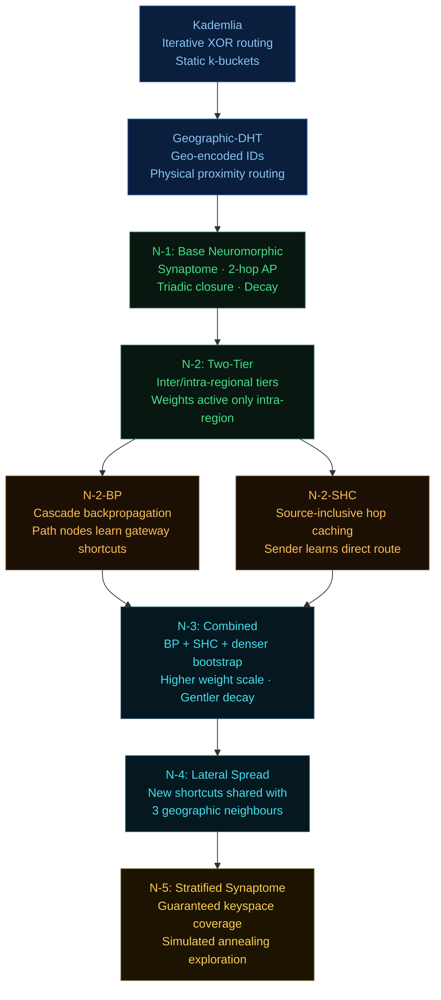
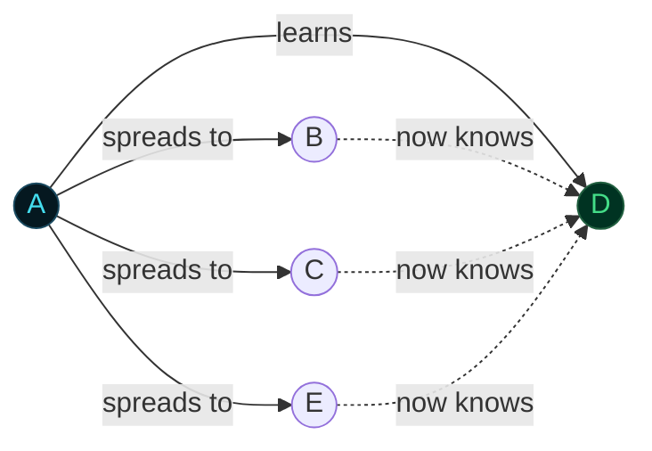
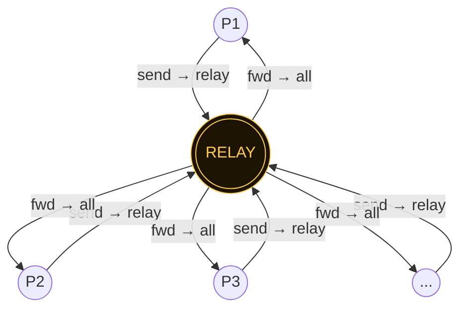

# DHT Globe Simulator

An interactive 3-D globe simulator for studying and comparing distributed hash table routing protocols, from classical Kademlia to a family of five neuromorphic protocols that learn and adapt their routing tables through simulated synaptic plasticity.

The simulator renders a live WebGL globe of up to 50,000 nodes distributed according to real-world population density, routes messages between them in real time, and benchmarks every protocol side by side — measuring hop counts, latency, churn resilience, regional performance, and learning convergence over time.

---

## Quick Start

```bash
git clone https://github.com/YZ-social/dht-sim.git
cd dht-sim
npm install
npm start          # starts static server on http://localhost:3000
```

Open `http://localhost:3000` in a modern browser. No build step required — the project uses native ES modules.

---

## System Architecture

```
┌────────────────────────────────────────────────────────────────┐
│  Browser  (index.html + ES modules, no bundler)                │
│                                                                │
│  ┌─────────────┐   ┌──────────────┐   ┌────────────────────┐  │
│  │  Controls   │   │    Main      │   │     Results        │  │
│  │  (UI strip) │──▶│ (orchestrat) │──▶│  (charts + table)  │  │
│  └─────────────┘   └──────┬───────┘   └────────────────────┘  │
│                           │                                    │
│              ┌────────────┼─────────────┐                      │
│              ▼            ▼             ▼                      │
│  ┌──────────────┐  ┌──────────┐  ┌───────────────┐            │
│  │  Globe.js    │  │ Engine   │  │  DHT Protocol │            │
│  │  (Three.js   │  │ (test    │  │  (one of 9    │            │
│  │   WebGL)     │  │  runner) │  │   protocols)  │            │
│  └──────────────┘  └──────────┘  └───────────────┘            │
│                                                                │
│  ┌─────────────────────────────────────────────────────────┐   │
│  │   Protocol family                                       │   │
│  │   Kademlia · Geographic · N-1 · N-2 · N-2-BP · N-2-SHC │   │
│  │                          · N-3 · N-4 · N-5             │   │
│  └─────────────────────────────────────────────────────────┘   │
└────────────────────────────────────────────────────────────────┘
         ▲
  node server.js  (express static server, port 3000)
```

### Key source files

| Path | Role |
|---|---|
| `index.html` | Shell, control strip HTML, results overlay HTML |
| `style.css` | All styling (dark theme, control groups, chart panels) |
| `src/main.js` | Orchestrator — wires controls → engine → globe → results |
| `src/simulation/Engine.js` | Test runner (lookup, churn, benchmark, concordance, pairs) |
| `src/ui/Controls.js` | Control strip read/write, button state machine |
| `src/ui/Results.js` | Chart.js rendering, CSV export, panel management |
| `src/globe/Globe.js` | Three.js globe, node dots, path arcs, country borders |
| `src/dht/kademlia/KademliaDHT.js` | Kademlia implementation |
| `src/dht/geographic/GeographicDHT.js` | Geographic-DHT (geo-encoded IDs) |
| `src/dht/neuromorphic/NeuromorphicDHT.js` | N-1 base neuromorphic |
| `src/dht/neuromorphic/NeuromorphicDHT2.js` | N-2 two-tier hierarchical |
| `src/dht/neuromorphic/NeuromorphicDHT2BP.js` | N-2-BP + cascade backpropagation |
| `src/dht/neuromorphic/NeuromorphicDHT2SHC.js` | N-2-SHC + source hop caching |
| `src/dht/neuromorphic/NeuromorphicDHT3.js` | N-3 combined + dense bootstrap |
| `src/dht/neuromorphic/NeuromorphicDHT4.js` | N-4 + lateral shortcut propagation |
| `src/dht/neuromorphic/NeuromorphicDHT5.js` | N-5 + stratified synaptome + annealing |
| `src/dht/neuromorphic/NeuronNode.js` | Per-node state: synaptome, transit cache |
| `src/dht/neuromorphic/Synapse.js` | Synapse data model (weight, latency, stratum) |
| `src/utils/geo.js` | Great-circle distance, latency model, population sampling |
| `src/utils/s2.js` | S2 cell encoding for geographic IDs |

---

## Routing Foundation: The XOR Keyspace

Every node in every protocol is assigned a 32-bit **G-ID** (Geographic Identifier). The routing distance between any two nodes is their XOR:

```
distance(A, B) = A.id XOR B.id
```

XOR distance is symmetric, satisfies the triangle inequality, and partitions the keyspace into a binary tree. The **stratum** of a peer is the number of matching leading bits:

```
stratum = clz32(A.id XOR B.id)   // 0 = far, 31 = very close

Stratum  0: nodes differ in bit 31 — opposite ends of keyspace (~10,000 km)
Stratum  8: share top 8 bits     — same continental region
Stratum 16: share top 16 bits    — same country / metro area
Stratum 24: share top 24 bits    — same city block (in geo-encoded protocols)
```

In Geographic-DHT and all neuromorphic protocols, the G-ID encodes geographic position in its high bits, so XOR distance approximates physical distance.

---

## Protocol 1: Kademlia DHT

Classical iterative Kademlia as described in the original Maymounkov & Mazières paper.

### Routing table

Each node maintains **k-buckets**: one bucket per bit position (32 buckets for a 32-bit keyspace), each holding up to `k = 20` nodes. Bucket `i` holds peers whose XOR distance shares `i` matching leading bits.

```
Node A's k-buckets:
Bucket  0 │ ██████████████████ 20 peers (far — different half of keyspace)
Bucket  8 │ █████████ 9 peers  (same continental prefix)
Bucket 16 │ ████ 4 peers       (same metro prefix)
Bucket 24 │ ██ 2 peers         (same block prefix)
Bucket 31 │ █ 1 peer           (immediate XOR neighbour)
```

### Lookup algorithm


1. Bootstrap a **shortlist** of the `k` closest known nodes to the target
2. Query the `α = 3` unqueried nodes with smallest XOR distance in parallel
3. Merge returned node lists into the shortlist; re-sort by XOR distance
4. Terminate when two consecutive rounds produce no strictly closer node
5. Hops = number of rounds (each round = one parallel α-query)

### Parameters

| Parameter | Value | Meaning |
|---|---|---|
| `k` | 20 | Bucket size / replication factor |
| `α` | 3 | Lookup parallelism |
| `bits` | 32 | Keyspace width |

**Performance characteristic:** hop count grows as O(log N) — roughly log₂(N) / log₂(k) rounds. With N=5,000 and k=20: ~2.5 hops. With N=1,000,000: ~5–7 hops. Performance is static — no learning.

---

## Protocol 2: Geographic DHT

Extends Kademlia by encoding geographic position in the G-ID, so that XOR distance approximates physical distance.

### ID encoding

```
G-ID (32 bits):
┌──────────────────┬──────────────────────────────────────┐
│  geoCellId       │  random suffix                       │
│  (high 8 bits)   │  (low 24 bits)                       │
└──────────────────┴──────────────────────────────────────┘
```

The `geoCellId` is derived from latitude/longitude using an S2-style cell encoding (`geoBits = 8` → 256 geographic cells worldwide). Nodes in the same geographic cell share a common 8-bit prefix, so they are XOR-close to each other.

**Result:** routing naturally prefers geographically nearby nodes, reducing average hop latency even when hop count is similar to Kademlia.

---

## Protocol Family: Neuromorphic DHT

The neuromorphic protocols replace the static k-bucket routing table with a **synaptome** — an adaptive, weighted graph of peer connections that strengthens frequently-used routes and prunes unused ones, analogous to synaptic long-term potentiation and depression in biological neural networks.

### Protocol evolution



### The Synaptome

Each neuromorphic node maintains a **synaptome** — a `Map<peerId, Synapse>` — instead of static k-buckets. Each `Synapse` carries:

```
Synapse {
  peerId:   number   // G-ID of connected peer
  weight:   float    // reliability score [0.0 – 1.0], initial = 0.5
  latency:  float    // round-trip time estimate (ms)
  stratum:  int      // clz32(myId XOR peerId) — XOR closeness bucket [0–31]
  inertia:  int      // epoch before which decay is suppressed (LTP lock)
}
```

Unlike k-buckets, the synaptome is **unbounded by design** and pruned by a decay mechanism that removes weak, infrequently-used connections.

### Action Potential (AP) routing

At each hop, the routing algorithm scores every synapse that makes **strict XOR progress** toward the target:

```
AP₁ = (currentDist − peerDist) / latency × (1 + WEIGHT_SCALE × weight)
         ────────────────────────            ─────────────────────────
              geographic progress               learned quality bonus
```

The **two-hop lookahead** extends this to evaluate the best two-hop path through each candidate:

```
AP₂ = totalProgress₂ / totalLatency₂ × (1 + WEIGHT_SCALE × weight_firstHop)
```

The candidate with the highest AP₂ is selected. This prevents routing into local XOR minima that would dead-end one hop later.

### Six learning phases (N-1 through N-5 all build on these)

```mermaid
flowchart TB
    subgraph P1["Phase 1 · Bootstrap"]
        direction LR
        B1["Build XOR routing table\nk nearest peers per stratum\nInitial synaptome"]
    end
    subgraph P2["Phase 2 · Action Selection"]
        direction LR
        B2["Two-hop lookahead AP\nGreedy forward routing\nε=5% random exploration"]
    end
    subgraph P3["Phase 3 · LTP Reinforcement"]
        direction LR
        B3["On success: wave backward\nweight += 0.2 per used synapse\nDecay-immune for 20 epochs"]
    end
    subgraph P4["Phase 4 · Structural Plasticity"]
        direction LR
        B4A["Triadic closure\nfrequent relay pairs introduced"]
        B4B["Hop caching\nshortcuts injected to traversed targets"]
    end
    subgraph P5["Phase 5 · LTD Decay"]
        direction LR
        B5["Every 100 lookups\nweight × DECAY_GAMMA\nPrune below threshold"]
    end
    P1 --> P2 --> P3 --> P4 --> P5
    P5 -->|"next lookup"| P2

    style P1 fill:#040e1c,stroke:#2a5ea0
    style P2 fill:#040e1c,stroke:#226040
    style P3 fill:#040e1c,stroke:#226040
    style P4 fill:#040e1c,stroke:#5a3a18
    style P5 fill:#040e1c,stroke:#1a4a60
```



---

## Protocol 3 — N-1: Base Neuromorphic

**File:** `src/dht/neuromorphic/NeuromorphicDHT.js`

The foundational neuromorphic protocol. Implements all six phases with the most conservative parameters.

### Key constants

```javascript
WEIGHT_SCALE         = 0.15   // learned weight bonus in AP formula
LOOKAHEAD_ALPHA      = 3      // candidates probed per 2-hop evaluation
INERTIA_DURATION     = 20     // epochs a reinforced synapse is decay-immune
DECAY_GAMMA          = 0.995  // per-tick weight multiplier  (~0.5% per 100 lookups)
DECAY_INTERVAL       = 100    // lookups between decay sweeps
PRUNE_THRESHOLD      = 0.10   // synapses below this weight are pruning candidates
INTRODUCTION_THRESHOLD = 1    // transits before triadic closure fires
EXPLORATION_EPSILON  = 0.05   // probability of random first-hop (exploration)
MAX_GREEDY_HOPS      = 40     // safety cap on path length
```

### Hop caching (intermediate nodes only)

During a lookup from A → B → C → D (target), nodes B and C each learn a direct shortcut to D:

```
Before lookup:  B.synaptome = {A, C, ...}
After lookup:   B.synaptome = {A, C, D, ...}  ← new shortcut to target
```

**Guard:** source node A is excluded from hop caching in N-1. Only intermediate and destination-adjacent nodes cache the target.

### Triadic closure

When nodes B and C repeatedly co-appear on the same path, node B introduces itself to C and vice versa:

```
Path:  A → B → C → D
Path:  E → B → C → F

After threshold=1 repeated (B,C) pair: B.synaptome gains direct entry for C
                                        C.synaptome gains direct entry for B
```

---

## Protocol 4 — N-2: Two-Tier Hierarchical

**File:** `src/dht/neuromorphic/NeuromorphicDHT2.js`

Adds a geographic tier boundary. Synaptic weights are active only when routing **within** the same coarse geographic region; cross-region routing uses pure geographic progress (AP with weight=0).

```javascript
GEO_REGION_BITS = 4   // 2⁴ = 16 coarse geographic cells
```

```
At each hop:
  inTargetRegion = ((currentId XOR targetId) >>> (32 − 4)) === 0

  if inTargetRegion:
      AP = progress / latency × (1 + 0.15 × weight)   // weights active
  else:
      AP = progress / latency × 1.0                    // pure geographic
```

**Rationale:** cross-continental routing benefits more from geographic accuracy than from learned traffic patterns; local routing benefits more from learned shortcuts.

---

## Protocol 5 — N-2-BP: Cascade Backpropagation

**File:** `src/dht/neuromorphic/NeuromorphicDHT2BP.js`

After a lookup succeeds via a **direct shortcut** at the final hop, all earlier nodes on the path learn that the penultimate node (the **gateway**) is a good relay toward the target:

```
Lookup: A → B → C → D (target, via direct shortcut C→D)

Cascade backprop fires:
  A.synaptome ← new synapse to C  (gateway, weight 0.1)
  B.synaptome ← new synapse to C  (gateway, weight 0.1)

Next lookup A→D:
  A sees C with 2-hop path A→C→D (AP 2-hop lookahead scores it)
  Eventually A→C weight reinforces until A→D direct forms
```

The relay shortcuts start at weight `0.1` (below the `0.5` of direct shortcuts) and only survive reinforcement — preventing relay paths from permanently outcompeting direct routes.

---

## Protocol 6 — N-2-SHC: Source-Inclusive Hop Caching

**File:** `src/dht/neuromorphic/NeuromorphicDHT2SHC.js`

Removes the source exclusion from hop caching. The **sender itself** now learns a direct shortcut to every target it routes to:

```javascript
// N-1 / N-2 guard (source excluded):
if (currentId !== sourceId && currentId !== targetKey) _introduce(currentId, targetKey)

// N-2-SHC guard (source included):
if (currentId !== targetKey) _introduce(currentId, targetKey)
```

**Effect:** on the second lookup from A to D, A finds D directly in its synaptome → **1 hop**. This is the most powerful single-mechanism improvement for repeated (source, target) pairs.

---

## Protocol 7 — N-3: Combined + Dense Bootstrap

**File:** `src/dht/neuromorphic/NeuromorphicDHT3.js`

Combines both N-2-BP and N-2-SHC, and tightens several parameters to produce a denser, more persistent routing web.

### Parameter changes from N-2

| Parameter | N-2 | N-3 | Effect |
|---|---|---|---|
| `WEIGHT_SCALE` | 0.15 | **0.40** | Learned shortcuts have 2.7× more AP influence |
| `LOOKAHEAD_ALPHA` | 3 | **5** | Evaluates 5 candidates per hop (wider search) |
| `DECAY_GAMMA` | 0.995 | **0.998** | Shortcuts survive ~3× longer without reinforcement |
| `PRUNE_THRESHOLD` | 0.10 | **0.05** | Synaptome stays denser; weak edges linger longer |
| `K_BOOT_FACTOR` | 1 | **2** | Bootstrap seeds 2k synapses per stratum (richer start) |
| `MAX_SYNAPTOME_SIZE` | ∞ | **800** | Hard memory cap per node |

### Interaction between BP and SHC

With both mechanisms active, the cascade backpropagation shortcut (relay at weight 0.1) is suppressed for nodes that already have a direct shortcut to the target via SHC (weight 0.5). The guard:

```javascript
if (fromNode && !fromNode.hasSynapse(targetKey)) {
    _introduce(fromNode, gateway, 0.1)  // only if no direct route exists
}
```

---

## Protocol 8 — N-4: Lateral Shortcut Propagation

**File:** `src/dht/neuromorphic/NeuromorphicDHT4.js`

When any node learns a **new direct shortcut** to a peer, it immediately shares that shortcut with its `LATERAL_K = 3` highest-trusted same-region neighbours:

```
Node A discovers shortcut A→D:

  A's geographic neighbours: B, C, E (same GEO_REGION_BITS cell)
  B.synaptome ← new synapse to D
  C.synaptome ← new synapse to D
  E.synaptome ← new synapse to D
```



**Passive dead-node eviction:** during candidate collection at each hop, if a synapse's peer is no longer alive, its weight is immediately zeroed. The next decay tick prunes it. This eliminates stale routing through dead nodes without any explicit failure detection protocol.

---

## Protocol 9 — N-5: Stratified Synaptome + Simulated Annealing

**File:** `src/dht/neuromorphic/NeuromorphicDHT5.js`

The most capable protocol. Adds two major mechanisms to N-4's foundation.

### Mechanism 1: Stratified Synaptome

Without structure, geographic training and lateral propagation would fill the synaptome entirely with nearby nodes, leaving no routing paths to distant parts of the keyspace. N-5 enforces **keyspace coverage** by partitioning the 32 strata into 8 groups of 4 and guaranteeing a minimum of `STRATUM_FLOOR = 3` synapses per group:

```
Synaptome structure (MAX_SYNAPTOME_SIZE = 800):

Group 0 │ strata  0– 3 │ ≥ 3 entries │ inter-continental long-range
Group 1 │ strata  4– 7 │ ≥ 3 entries │ cross-continental
Group 2 │ strata  8–11 │ ≥ 3 entries │ intra-continental
Group 3 │ strata 12–15 │ ≥ 3 entries │ regional
Group 4 │ strata 16–19 │ ≥ 3 entries │ sub-regional
Group 5 │ strata 20–23 │ ≥ 3 entries │ metro area
Group 6 │ strata 24–27 │ ≥ 3 entries │ neighbourhood
Group 7 │ strata 28–31 │ ≥ 3 entries │ immediate XOR neighbours
         └─────────────────────────────
         Remaining 776 slots filled freely by traffic patterns
```

**Eviction policy:** when the synaptome is full, the weakest synapse from the most **over-represented** group is evicted to admit the new entry — as long as that group still has more than `STRATUM_FLOOR` entries. Groups at the floor cannot be evicted.

### Mechanism 2: Simulated Annealing

Each node carries a **temperature** `T` that starts at `T_INIT = 1.0` and cools multiplicatively:

```
T ← max(T_MIN, T × ANNEAL_COOLING)     (ANNEAL_COOLING = 0.9997 per lookup)
```

After each hop (with probability `T`), the node fires an annealing step:

```mermaid
flowchart TD
    A[Identify most over-represented group → evict candidate]
    A --> B[Identify most under-represented group → target range]
    B --> C{prob = T × GLOBAL_BIAS}
    C -->|"Global search\n(high T / early)"| D["Random node from full\nnetwork in target stratum"]
    C -->|"Local search\n(low T / later)"| E["Random peer-of-peer\nin target stratum\n(up to 20 candidates)"]
    D --> F[Install new synapse at weight 0.1]
    E --> F
    style C fill:#1c1400,stroke:#5a4818,color:#ffcc55
    style D fill:#040e1c,stroke:#2a5ea0
    style E fill:#040e1c,stroke:#226040
```



| Annealing constant | Value | Meaning |
|---|---|---|
| `T_INIT` | 1.0 | Full exploration at node birth |
| `T_MIN` | 0.05 | Minimum exploration floor |
| `ANNEAL_COOLING` | 0.9997 | ~0.03% cooling per lookup |
| `GLOBAL_BIAS` | 0.5 | P(global vs. local search) at T=1 |
| `ANNEAL_LOCAL_SAMPLE` | 20 | Max 2-hop candidates per local search |
| `ANNEAL_BUF_REBUILD` | 200 | Rebuild global node buffer every N lookups |

**Phase transition:** early in a node's lifetime (T≈1), annealing aggressively explores the global keyspace, rapidly seeding all 8 stratum groups. As T cools, exploration shifts to local 2-hop neighbourhood refinement, exploiting the structure built during the high-temperature phase.

---

## Protocol Comparison

### Parameters at a glance

| Protocol | Weight scale | Lookahead | Decay γ | Prune | Boot × | Lateral | Annealing | Stratified |
|---|---|---|---|---|---|---|---|---|
| Kademlia | — | — | — | — | 1 | No | No | No |
| G-DHT-8 | — | — | — | — | 1 | No | No | No |
| N-1 | 0.15 | α=3 | 0.995 | 0.10 | 1 | No | No | No |
| N-2 | 0.15 | α=3 | 0.995 | 0.10 | 1 | No | No | No |
| N-2-BP | 0.15 | α=3 | 0.995 | 0.10 | 1 | No | No | No |
| N-2-SHC | 0.15 | α=3 | 0.995 | 0.10 | 1 | No | No | No |
| N-3 | **0.40** | **α=5** | **0.998** | **0.05** | **2** | No | No | No |
| N-4 | 0.40 | α=5 | 0.998 | 0.05 | 2 | **K=3** | No | No |
| N-5 | 0.40 | α=5 | 0.998 | 0.05 | 2 | K=3 | **Yes** | **Yes** |

### Additive mechanism matrix

| Mechanism | N-1 | N-2 | N-2-BP | N-2-SHC | N-3 | N-4 | N-5 |
|---|:---:|:---:|:---:|:---:|:---:|:---:|:---:|
| 2-hop AP routing | ✓ | ✓ | ✓ | ✓ | ✓ | ✓ | ✓ |
| LTP reinforcement | ✓ | ✓ | ✓ | ✓ | ✓ | ✓ | ✓ |
| Triadic closure | ✓ | ✓ | ✓ | ✓ | ✓ | ✓ | ✓ |
| LTD decay + pruning | ✓ | ✓ | ✓ | ✓ | ✓ | ✓ | ✓ |
| Two-tier AP tiers | — | ✓ | ✓ | ✓ | ✓ | ✓ | ✓ |
| Cascade backpropagation | — | — | ✓ | — | ✓ | ✓ | ✓ |
| Source hop caching | — | — | — | ✓ | ✓ | ✓ | ✓ |
| Dense bootstrap (2k) | — | — | — | — | ✓ | ✓ | ✓ |
| Passive dead-node eviction | — | — | — | — | — | ✓ | ✓ |
| Lateral shortcut propagation | — | — | — | — | — | ✓ | ✓ |
| Stratified synaptome | — | — | — | — | — | — | ✓ |
| Simulated annealing | — | — | — | — | — | — | ✓ |

---

## Test Infrastructure

### Lookup Test

Routes `N` messages (configurable, default 500) from randomly chosen sources to randomly chosen targets. Measures:

- **Average hops** and p95 hops
- **Average time** (ms) and p95 time
- **Success rate** (% of messages that find their target)
- Optional modes: **Regional** (source and target within radius R km), **Source** (source from a population cluster), **Destination** (target from a cluster)

Displays the final routed path on the globe as a glowing arc.

### Churn Test

Simulates **node turnover** by repeatedly killing and replacing a fraction of the network (configurable churn rate, default 5% per interval). After each churn event:

1. Kill `churnRate%` of alive nodes
2. Spawn `churnRate%` new nodes with fresh synaptomes
3. Run `lookups/interval` messages
4. Record the hop count and success rate degradation over time

Measures resilience: how quickly does each protocol recover its routing quality as the population churns?

### Train Network

Runs continuous lookup sessions on the currently selected protocol, graphing convergence over time:

- **Session graph:** average hops and average time per session (Y-axis scaled to min–max range)
- **Session log:** scrolling record of each session's stats
- **Baseline:** session 0 recorded before any warmup, shown as a reference line
- **Warmup:** configurable number of warmup sessions (default 4 × 500 = 2,000 lookups) run before the baseline measurement

Neuromorphic protocols converge downward as the synaptome learns frequent routes. Kademlia is flat (no learning).

### Benchmark

Runs all 9 protocols in sequence on identical traffic, producing a comparative table. Each protocol:

1. Receives the same node set (same `seed` → same G-ID positions)
2. Runs `warmupLookups` to train neuromorphic synaptomes
3. Runs `benchLookups` (500) measured lookups per test scenario
4. Results reported: hops mean/p95, time mean/p95, for each column

**Test columns:**
- **Global** — uniformly random source/target pairs
- **500 km / 1,000 km / 2,000 km / 5,000 km** — regional radius constraints
- **10% Src** — sources drawn from a geographic population cluster
- **10% Dest** — destinations drawn from a geographic population cluster
- **10%→10%** — both source and destination from clusters
- **N.Am.–Asia** — trans-Pacific continent-crossing lookups
- **5% Churn** — 5% node replacement, measuring post-churn routing quality

### Concordance Test

Models a **star overlay network** with one relay and N participants (configurable, default 32):



Each session:
1. Each participant routes a message to the relay → records hops-to-relay
2. The relay routes a message to each participant → records hops-from-relay

Neuromorphic protocols converge toward 1 hop in both directions as the relay's identity becomes embedded in the synaptome of all participants and vice versa. Graphs both directions over sessions.

### Pair Learning

Assigns each node a **fixed random target** at test start — every node will always send to the same partner for the duration of the test:

```
At start:  for each node Aᵢ: assign target Bᵢ (random, fixed)

Session 1: A₁→B₁, A₂→B₂, ... Aₙ→Bₙ  (measure avg hops)
Session 2: A₁→B₁, A₂→B₂, ... Aₙ→Bₙ  (shortcuts forming)
Session k: A₁→B₁, A₂→B₂, ... Aₙ→Bₙ  (approaching 1 hop)
```

This models **persistent communication pairs** — the dominant real-world traffic pattern in messaging, streaming, and IoT applications. The fixed routing demand gives the neuromorphic synaptome exactly the repeated-pair signal needed to form direct shortcuts.

- Y-axis starts at 1.0 (theoretical minimum) with a dashed goal line
- Neuromorphic protocols trend toward 1 hop; classical protocols stay flat

---

## Configuration Parameters

### Network

| Control | Range | Default | Description |
|---|---|---|---|
| Protocol | dropdown | N-5 | Which protocol to run |
| Nodes | 100–50,000 | 5,000 | Number of nodes in the network |
| K | 5–40 | 20 | Bucket / synaptome seed width |
| α | 1–7 | 3 | Lookup parallelism |
| Bits | 16–32 | 32 | Keyspace width |
| Delay | 0–200 ms | 10 | Base latency offset |

### Lookup

| Control | Range | Default | Description |
|---|---|---|---|
| Count | 50–2000 | 500 | Messages per test session |
| Hot% | 0–50 | 2 | % of traffic targeting popular nodes |

### Churn

| Control | Range | Default | Description |
|---|---|---|---|
| Rate | 0–30% | 5 | % of nodes replaced per churn event |
| Interval | 1–20 | 10 | Lookups between churn events |
| L/Int | 10–1000 | 100 | Lookups per interval |

### Filters

| Control | Description |
|---|---|
| □ Regional | Constrain source/target to within R km |
| Radius | Regional radius in km |
| □ Src | Enable source-population clustering |
| Src% | % of traffic from a geographic cluster |
| □ Dest | Enable destination-population clustering |
| Dest% | % of traffic to a geographic cluster |

### Benchmark / Concordance

| Control | Range | Default | Description |
|---|---|---|---|
| Churn% | 0–20 | 5 | Churn percentage for churn benchmark column |
| Warmup | 1–10 | 4 | Training sessions (× 500 lookups) before baseline |
| □ Rotate | — | off | Auto-rotate globe during benchmark |
| Conc. Nodes | 4–256 | 32 | Participants in the Concordance overlay |

---

## Latency Model

Hop latency is computed from great-circle distance between nodes plus a configurable base delay:

```
RTT(A, B) = 2 × (great_circle_km(A, B) / SPEED_OF_LIGHT_KM_MS) + BASE_DELAY_MS
```

Geographic-DHT and neuromorphic protocols use this latency both as the AP denominator (favouring fast hops) and as the `latency` field stored in each synapse.

---

## Recreating a Protocol

To implement any neuromorphic protocol from scratch:

### Step 1 — Node state

```javascript
class NeuronNode {
  constructor(id, lat, lng) {
    this.id         = id
    this.lat        = lat
    this.lng        = lng
    this.alive      = true
    this.synaptome  = new Map()   // peerId → Synapse
    this.transitCache = new Map() // "fromId_toId" → count
  }
  hasSynapse(peerId) { return this.synaptome.has(peerId) }
  progressCandidates(targetId) {
    const myDist = (this.id ^ targetId) >>> 0
    return [...this.synaptome.values()]
      .filter(s => ((s.peerId ^ targetId) >>> 0) < myDist && nodeMap.get(s.peerId)?.alive)
  }
}
```

### Step 2 — Synapse

```javascript
class Synapse {
  constructor(peerId, latencyMs) {
    this.peerId   = peerId
    this.weight   = 0.5
    this.latency  = latencyMs
    this.stratum  = Math.clz32((myId ^ peerId) >>> 0)
    this.inertia  = 0
  }
  reinforce(epoch, inertiaDuration) {
    this.weight  = Math.min(1.0, this.weight + 0.2)
    this.inertia = epoch + inertiaDuration
  }
}
```

### Step 3 — AP routing loop

```javascript
function lookup(sourceId, targetId) {
  let currentId = sourceId
  const path = [sourceId]
  for (let hop = 0; hop < MAX_GREEDY_HOPS; hop++) {
    const node = nodeMap.get(currentId)
    if (currentId === targetId) break
    const candidates = node.progressCandidates(targetId)
    if (!candidates.length) break
    const best = bestByTwoHopAP(node, candidates, targetId, WEIGHT_SCALE)
    path.push(best.peerId)
    currentId = best.peerId
  }
  return { found: currentId === targetId, hops: path.length - 1, path }
}
```

### Step 4 — Learning (add after each successful lookup)

```javascript
// LTP — reinforce used synapses
for (const { synapse } of trace) synapse.reinforce(epoch, INERTIA_DURATION)

// Hop caching — intermediate nodes learn target shortcut
for (const step of trace) {
  if (step.fromId !== targetId) _introduce(step.fromId, targetId, 0.5)
}

// Periodic decay
if (++lookupCount % DECAY_INTERVAL === 0) tickDecay()

function tickDecay() {
  for (const node of nodeMap.values())
    for (const syn of node.synaptome.values()) {
      if (syn.inertia < epoch) syn.weight *= DECAY_GAMMA
      if (syn.weight < PRUNE_THRESHOLD) node.synaptome.delete(syn.peerId)
    }
}
```

---

## Running the Tests Programmatically

The `Engine` class exposes async methods that can be called independently:

```javascript
import { SimulationEngine } from './src/simulation/Engine.js'

const engine = new SimulationEngine()

// Single lookup test
const result = await engine.runLookupTest(dht, {
  numMessages:    500,
  captureLastPath: false,
  regional:       false,
  hotPct:         0,
  sourcePct:      0,
  destPct:        0,
})
// result: { hops, time, totalRuns, successes, successRate }

// Concordance session
const concResult = await engine.runConcordanceSession(dht, relay, participants, {
  captureLastPath: false,
})
// concResult: { toRelay, fromRelay, successTo, successFrom }

// Pair learning session
const pairResult = await engine.runPairSession(dht, pairs)
// pairResult: { hops, time, hopsRaw, timeRaw, successCount }
// pairs: Array<{ srcId: number, dstId: number }>
```

---

## Browser Compatibility

Requires a browser with native ES module support and WebGL 1.0:

- Chrome 80+
- Firefox 75+
- Safari 14+
- Edge 80+

No build tools, no transpilation, no CDN dependencies beyond `Chart.js` and `Three.js` (both loaded via `importmap` in `index.html`).

---

## License

MIT
