<!-- _class: title -->

# Neuromorphic DHT

## A Learning-Adaptive Distributed Hash Table
## with Axonal Publish-Subscribe

<br>

*Research brief · 25 K-node benchmark · Whitepaper v0.56*

<br><br>

<span class="muted">Source, data, and simulator: <code>github.com/YZ-social/dht-sim</code></span>

---

## Three gaps in current DHTs

**No locality.**
Kademlia at 25 K nodes routes a **500 km lookup in 355 ms** — no better than a global lookup.

**Pub/sub is a bolt-on.**
K-closest replication drifts under churn; publisher and subscriber compute different top-K sets, and delivery collapses.

**Churn recovery is lazy.**
Kademlia repairs routing tables on bucket-refresh timers; subscribers miss messages during the gap.

<br>

<span class="callout">This talk: a single protocol addressing all three, measured end-to-end.</span>

---

## The Neuromorphic DHT in one slide

- **Adaptive routing.** Each node maintains a bounded table of weighted edges, reinforced by observed traffic.
- **Locality in IDs.** 8-bit geographic cell prefix (Google **S2** Hilbert-curve index) + BigInt node key — routes follow geography with no extra mechanism.
- **Pub/sub as a routed tree.** Topics grow their own per-topic delivery trees, self-heal via re-subscription.

<br>

### Realistic deployment — 25 K nodes · bootstrap + 50 K training lookups · web-connection cap

| Workload | Kademlia | G-DHT | **N-DHT** |
|---|---|---|---|
| Global lookup | 4.70 hops · 536 ms | 5.65 hops · 318 ms | **4.22 hops · 243 ms** |
| 500 km regional | 4.62 hops · 517 ms | 4.73 hops · 153 ms | **2.62 hops · 73 ms** |
| 2000 km regional | 4.60 hops · 521 ms | 5.14 hops · 187 ms | **3.00 hops · 92 ms** |
| Global success | 98.4 % | 99.4 % | **100 %** |

<span class="muted" style="font-size:18px">Plus N-DHT axonal pub/sub: 100 % baseline delivery; cumulative delivery &gt; 80 % through 33 % cumulative churn.</span>

---

## The DHT contract

**put(key, value), get(key) → value** on an untrusted, open peer-to-peer overlay.

The abstraction beneath pub/sub, naming, content addressing, blockchains, decentralized databases.

<br>

### Correctness means:
- **O(log N)** lookup path length
- Eventual consistency under churn
- No central authority or trusted coordinator

<br>

<span class="callout">Opening question: what is the best we can do on this abstraction in 2026?</span>

---

## Kademlia distilled

- **Distance metric:** XOR — `d(a, b) = a ⊕ b`
- Every node maintains K peers per bucket
- **Lookup** = greedy walk toward target in XOR distance; α parallel queries (α = 3), K = 20
- Under perfect conditions: **O(log N)** hops

<br>

<span class="muted">K-buckets were a 2002 answer to "what's a stable routing table?" — static, predictable, analyzable.
We will argue that adaptive weighting does better in practice.</span>

---

## Kademlia's structural limits

| Limit | Evidence |
|---|---|
| No locality awareness | 500 km lookup = **355 ms** — identical to global |
| Fixed buckets | Same K peers whether useful or not; no response to traffic |
| Lazy churn repair | Broken edges persist until next bucket refresh |
| Broadcast cost O(audience) | Each recipient reached by independent lookup |

<br>

<span class="callout">The data structure is frozen. The network is not.</span>

---

## G-DHT: locality helps, but alone is not enough

- **nodeId = S2 cell prefix ‖ publicKey hash**
- XOR in ID space ≈ XOR in physical distance (the prefix dominates)
- Regional latency drops: **128 ms at 500 km** vs Kademlia's 355 ms — **2.7× faster**

<br>

But still a *static* routing algorithm. No learning. No dynamics.

<br>

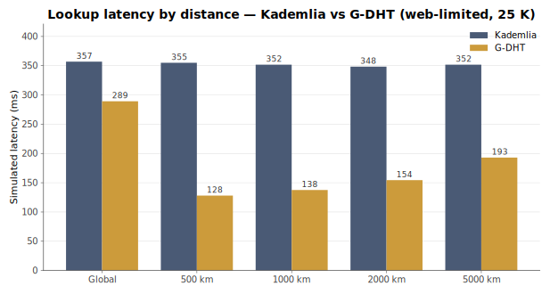

---

## The lab bench

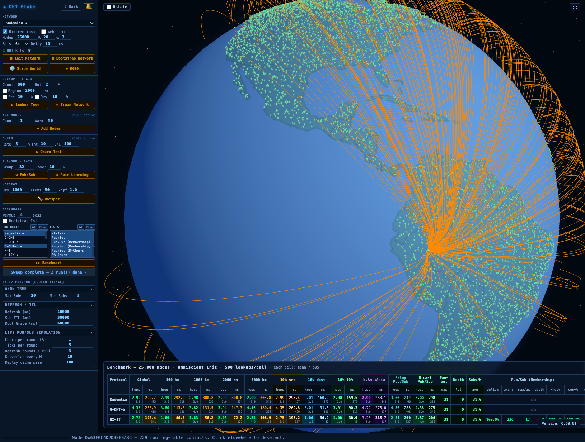

Purpose-built simulator · ~25 K lines of JavaScript · open-source.

**Modelled with fidelity**
- GeoJSON land mask; haversine distances
- Up to 50 000 nodes on a navigable 3-D globe
- Per-hop simulated latency including 10 ms transit cost
- Every hop, ACK, reroute captured

**Abstracted**
- No wall-clock transport or encryption
- In-process node identity

**Reproducibility**
- All protocols build from the *same* seeded node set
- CSV export per run — everything in this deck is from <code>results/*.csv</code>

<span class="muted" style="font-size:18px">Pictured: a single selected node and its ~220 routing-table contacts.</span>

---

## Methodology

- **500 lookups per test cell:** global, 5 radii (500 / 1k / 2k / 5k km), source-dest pools, cross-continent
- **Warmup** distinguishes *omniscient* init (theoretical ceiling) from *bootstrap* init (sponsor-chain join, production)
- **Churn** induced discretely (instantaneous kill) or continuously (1 % every 5 ticks)
- **Success** = surviving subscribers receive the message; dead subscribers excluded from denominator
- All three protocols tested on the **same node geometry**

<br>

<span class="callout">Direct comparison — not three independent builds.</span>

---

## Naming as compact vocabulary

Four terms from neuroscience, each mapping to a specific data structure.

| Term | Maps to |
|---|---|
| **Synapse** | One directed routing edge, with a learned weight ∈ [0, 1] |
| **Synaptome** | The full edge set at a node — bounded at 50, a safe cross-browser WebRTC target |
| **Neuron** | A node: synaptome + temperature + message handlers |
| **Axon** | A directed delivery tree for one pub/sub topic, grown by routed subscribe |

<br>

<span class="muted">Vocabulary choice, not ideology. The behavior does not depend on the biology.</span>

---

## The synaptome

Each synapse: <code>{ peerId, weight, inertia, stratum, latency, lastUsed }</code>

- **Weight** is the learned signal — reinforced on use (+δ), decayed on idle (×γ per tick)
- **Inertia** protects newly-added synapses — young edges cannot be evicted
- **Stratum** = `clz64(self.id ⊕ peer.id)` — indexes the Kademlia-style distance bucket
- **Capacity 50** is binding. Adding a 51ˢᵗ synapse evicts the lowest-vitality existing one.

<br>

<span class="callout">The routing table is a bounded, learned, traffic-shaped object.</span>

---

## Action Potential routing

Per-hop decision: pick the synapse maximizing

<br>

<div style="text-align:center; font-size:1.2em">
<code><strong>AP</strong> = (progress / latency) × (1 + w · weight)</code>
</div>

<br>

- **`progress`** = immediate XOR improvement toward target
- **`weight`** biases toward recently-useful peers
- **`latency`** normalizes for link cost
- **`w`** is a scalar tuning parameter (default 0.40)

<br>

### Two-hop lookahead

Top α = 5 first-hop candidates get a second-hop probe.
The pair with best combined AP wins.
Mitigates greedy local minima at bounded cost.

<br>

<span class="muted">Analogue: OSPF shortest-path plus weighted-edge reinforcement.</span>

---

## LTP — additive reinforcement

**Long-Term Potentiation:** every successful hop reinforces the used synapse by **+δ = 0.05**.

<br>

Analogue: **TCP AIMD, applied to the routing graph.**

| Action | Effect |
|---|---|
| Successful delivery | weight += δ (additive increase) |
| Passive decay each tick | weight ×= γ (multiplicative decrease, γ = 0.995) |
| Inertia window (20 epochs) | young synapses protected from eviction |

<br>

<span class="callout">Net effect: frequently-used routes accumulate weight; cold routes decay;
the synaptome tracks actual traffic patterns.</span>

---

## Decay, annealing, exploration

**Decay γ = 0.995 per tick** across all weights. Use-it-or-lose-it regularization — prevents stale edges from ossifying.

<br>

**Annealing:** periodically, a probabilistic draw replaces the lowest-weight synapse with a candidate sampled from the **2-hop neighborhood**. Temperature controls intensity; cools over time.

<br>

<span class="muted">Analogue: simulated annealing as background exploration pressure on the routing graph. Prevents local optima.</span>

<br>

### Temperature reheat under churn

Discovering a dead peer spikes the local temperature — accelerates replacement search.

---

## Incoming-synapse promotion

- Passive observation: every time another node routes *through* me, I record them in an incoming set
- After N transits, incoming peers get promoted to full outgoing synapses
- Closes the loop: traffic patterns inform the routing graph **in both directions**

<br>

<span class="callout">Reciprocity discovery falling out of routing traffic — no explicit messaging.</span>

---

## Churn mechanisms

Three composable responses to peer failure.

**Dead-peer eviction.**
Liveness check fails → synapse evicted. Replacement drawn from the 2-hop neighborhood.

**Iterative fallback.**
If no greedy candidate makes progress, fall back to Kademlia-style "closest unvisited". Prevents dead-end failures.

**Temperature reheat.**
Dead-peer discovery spikes the local annealing temperature, accelerating repair.

<br>

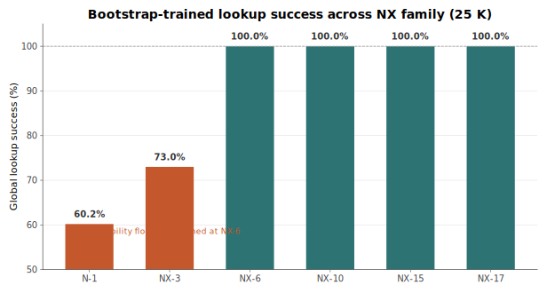

---

## Diversified bootstrap (80 / 20)

Sponsor-chain join alone produces **locality-biased synaptomes** — all neighbors are geographically close.

<br>

**Fix:** 80 % stratified by XOR distance + **20 % random global peers**.

- The 20 % random seeds annealing with diverse long-range candidates
- Without it, annealing can only see 2-hop-local peers, and the learning asymptote sits higher

<br>

<span class="muted">Analogue: Watts–Strogatz small-world — a small fraction of long-range edges
collapses expected path length.</span>

---

## Per-hop compute cost — the honest trade-off

Per hop, N-DHT evaluates:

1. Sort candidates by AP₁ score — O(N log N), N ≤ 50
2. Top α = 5 probed for 2-hop lookahead — each expands ≤ 50 synapses, runs a second sort
3. Liveness check per candidate; LTP update on the winner

<br>

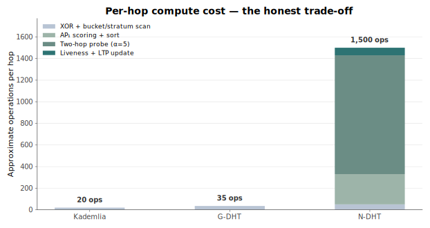

<br>

<span class="muted">Trade accepted: expensive decision → shorter paths + lower simulated latency.
Optimization room exists (top-K heap, last-hop shortcut, AP memoization).</span>

---

## End-to-end tick

One lookup in real time:

1. **AP-score** every synaptome candidate (with 2-hop probe on top 5)
2. **Pick best** next hop, send message
3. On arrival: **LTP-reinforce** the used synapse
4. Periodic maintenance:
   - decay all weights
   - anneal a replacement candidate
   - check for dead peers → evict + reheat

<br>

<span class="callout">No global state. No coordinators. Every tick is local.</span>

---

## Point-to-point: hops by distance

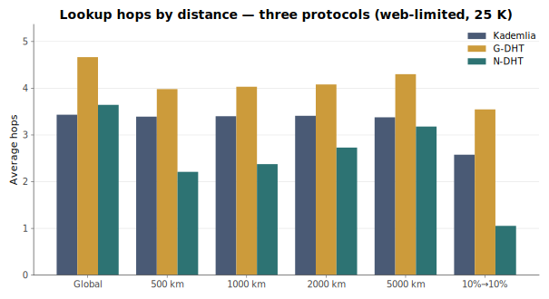

| | Kademlia | G-DHT | **N-DHT** |
|---|---|---|---|
| Global | 3.43 | 4.67 | **3.64** |
| 500 km | 3.39 | 3.98 | **2.21** |
| 2000 km | 3.41 | 4.08 | **2.73** |
| 10 % → 10 % | 2.58 | 3.55 | **1.05** |

---

## Point-to-point: latency by distance

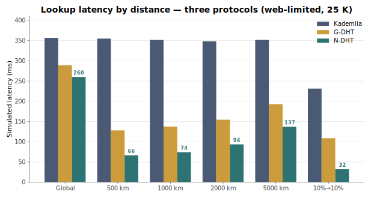

| Radius | Kademlia | G-DHT | **N-DHT** | vs Kademlia |
|---|---|---|---|---|
| Global | 357 ms | 289 ms | **260 ms** | 1.4× |
| 500 km | 355 ms | 128 ms | **66 ms** | <span class="hi">5.4×</span> |
| 2000 km | 348 ms | 154 ms | **94 ms** | 3.7× |
| 10 % → 10 % | 231 ms | 109 ms | **32 ms** | <span class="hi">7.2×</span> |

---

## Realistic deployment — bootstrap init + training

Omniscient init isolates protocol effects. **It is unreachable in production.**

<br>

Under bootstrap init + 50 K training lookups (the realistic deployment scenario):

| | Kademlia | G-DHT | **N-DHT** |
|---|---|---|---|
| Global hops | 4.70 | 5.65 | **4.22** |
| Global latency | 536 ms | 318 ms | **243 ms** |
| 2000 km latency | 521 ms | 187 ms | **92 ms** |
| Global success | 98.4 % | 99.4 % | **100 %** |

<br>

<span class="callout">N-DHT wins every column. The margins are *larger* than in the omniscient comparison
because K-DHT and G-DHT inherit permanent bootstrap penalties; N-DHT's learning converges around it.</span>

---

## Realistic deployment — charted

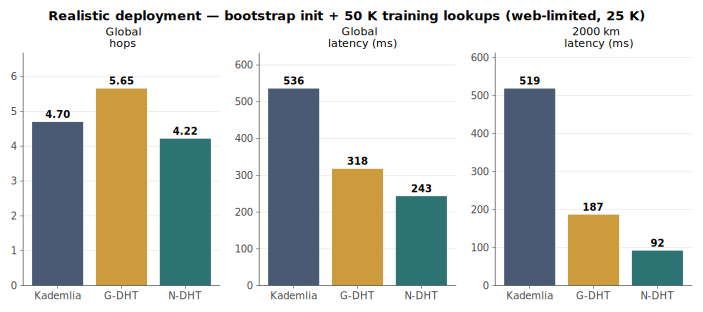

<span class="muted">Bootstrap init + 50 K warmup lookups. Web-limited (50-peer cap). 25 K nodes.
The realistic deployment scenario a production system actually faces.</span>

---

## Unrestricted — scaling beyond the browser

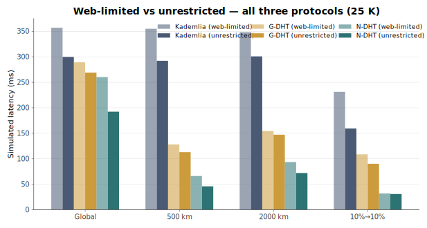

- Removing the 50-connection cap improves **all three** protocols
- N-DHT retains (and slightly extends) its lead
- N-DHT unrestricted: **2.72 hops · 46 ms at 500 km · 30 ms on source-dest pool**

---

## Learning has a fixed point

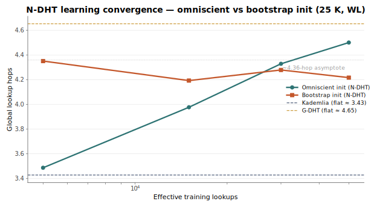

- Omniscient-init drifts **up** from 3.49 → 4.50 hops over 50 K training lookups
- Bootstrap-init drifts **down** from 4.35 → 4.22 hops
- Both converge on ~4.2–4.3 hops — *independent of starting condition*
- K-DHT and G-DHT remain flat: no learning dynamics

---

## What training does and doesn't do

**Training redistributes weight** within the fixed-capacity synaptome.
It does **not** discover new short edges that sponsor-chains missed at join time — annealing's replacement pool is 2-hop-local.

<br>

### Consequences

- Bootstrap + training **latency** improves monotonically (-14 % at 2000 km) — per-hop compute prunes
- Bootstrap + training **hop count** converges to the ~4.25-hop asymptote, not further
- The real lever for bootstrap quality is the **initial synaptome construction**

<br>

<span class="callout">Training is compute-optimizing, not primarily path-shortening.
An honest characteristic, not a defect.</span>

---

## Why pub/sub on DHTs is hard

The **K-closest approach** (NX-15 and predecessors):

- every subscribe STOREs at each of K nodes closest to `hash(topic)`
- publish hits any one of the K replicas

<br>

Under churn, publisher and subscriber compute `findKClosest` from different positions.
Their top-K sets drift apart. Delivery drops.

<br>

<span class="callout">At 25 % churn in our NX-15 lineage: ~38 % recovered delivery.
Direct motivation for redesign.</span>

---

## Publisher-prefix topic IDs

<br>

<div style="text-align:center; font-size:1.2em">
<code><strong>topicId</strong> = publisher.cellPrefix (8 bits) ‖ hash₅₆(event_name)</code>
</div>

<br>

- Convention: <code>@XX/domain/event</code> — XX = hex of publisher's S2 cell prefix
- Both publisher and every subscriber **derive the same topic ID deterministically**
- No cross-party disagreement, regardless of churn
- Topic anchor in the publisher's cell; well-trained from the publisher's own lookup traffic

---

## The axonal tree

Subscribe is a routed message toward <code>topicId</code>.
The first live **axon role** on the path intercepts and adds the subscriber to its children.

<br>

If no axon exists, the terminal node (via <code>findKClosest(topicId, 1)</code>) opens a role and becomes **root**.

<br>

Publish at root → fan-out to children via direct 1-hop sends → recursive through sub-axons.

<br>

<span class="callout"><strong>Single root per topic. No K-closest replication. No gossip.</strong></span>

---

## Batch adoption on overflow

When an axon hits 50 direct children (maxDirectSubs), it cannot grow.

**Solution:**
1. Pick an external synaptome peer as a new sub-axon relay
2. Partition children by XOR-proximity to the new relay
3. Hand off the top-K batch in a single <code>pubsub:adopt-subscribers</code> message

<br>

### Invariants preventing cascades
- Partition always non-empty (top-K guaranteed)
- Parent pre-adds the new relay as its own child → relay's self-subscribe loopback is idempotent

---

## Self-healing via re-subscribe

**No parentId tracking.**
Every role re-issues a subscribe on its refresh interval (10 s default).

- Non-root axon's refresh re-attaches to whichever live axon its walk lands on — parent reorganizations are invisible
- Root superseded by a newly-joined closer peer hands off via the globality check

<br>

<span class="callout">The re-subscribe <em>is</em> the liveness check — no separate ping RPC.</span>

---

## Replay cache

Every relay keeps a bounded ring buffer: <code>[{ json, publishId, publishTs }, …]</code>, capacity 100.

Every outgoing subscribe carries <code>lastSeenTs</code> — the highest publishTs the subscriber has observed.

On subscribe arrival, the axon filters its cache to <code>publishTs > lastSeenTs</code> and replays as a **single batched message**.

<br>

<span class="muted">Analogue: anycast with bounded local history. The nearest live relay serves
missed messages without a central log.</span>

---

## Live-simulation results

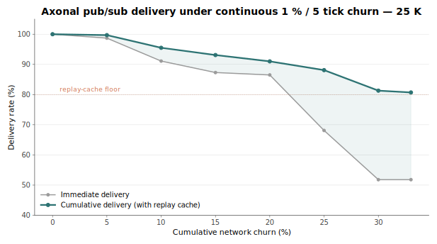

25 K nodes · 79 groups × 32 subscribers · 1 % churn every 5 ticks · 200+ ticks.

- 5 % cumulative churn: immediate 98.7 %, **cumulative 99.7 %**
- 25 % cumulative churn: immediate 68 %, **cumulative 88 %** — replay rescues 20 pp
- 33 % cumulative churn: **cumulative still > 80 %**

---

## Discrete-churn benchmark

Instantaneous kill at target rate. Measure baseline, immediate (post-kill, no refresh), recovered (after 3 refresh rounds). N = 5 replicates.

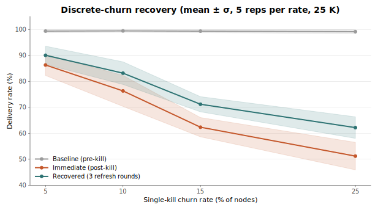

| Churn | Immediate | **Recovered (3 rounds)** |
|---|---|---|
| 5 % | 86.3 ± 4.0 % | **90.0 ± 3.5 %** |
| 10 % | 76.3 ± 6.0 % | **83.2 ± 4.4 %** |
| 15 % | 62.3 ± 3.7 % | **71.2 ± 2.9 %** |
| 25 % | 51.2 ± 5.3 % | **62.2 ± 4.1 %** |

---

## Three refresh rounds is the asymptote

Compared recovered delivery at **3 vs 10 rounds** across all four churn rates.

| Rate | Recovered (3r) | Recovered (10r) | Δ |
|---|---|---|---|
| 5 % | 90.0 % | 89.4 % | −0.6 |
| 10 % | 83.2 % | 81.5 % | −1.7 |
| 15 % | 71.2 % | 70.2 % | −1.0 |
| 25 % | 62.2 % | 61.2 % | −1.0 |

<br>

K-set stability **identical** between 3- and 10-round measurements — the tree has healed as far as it will.

<br>

<span class="callout">Additional refresh rounds do not recover more delivery.
The honest floor is K-set drift survival — not a tunable parameter.</span>

---

## Known limitations

- **Warmup dependency.** N-DHT needs ~5 000 lookups before the synaptome converges. The first minute of deployment is suboptimal.
- **Synaptome capacity is bounded at 50.** A deliberate cross-browser target — Chromium hard-caps at 500 (`kMaxPeerConnections`); practical ceiling for stable P2P is ~100–150; Safari/iOS is more constrained. Server deployments could use 200–500.
- **Forwarder loss edge cases.** If an axon relay dies mid-fan-out, its subtree goes silent until refresh. Survivable (100 % eventual via replay) — not instantaneous.
- **Training is compute-optimizing, not path-shortening.** Training cannot close the bootstrap → omniscient hop gap.

<br>

<span class="muted">All measurable. All addressable — noted, not hand-waved.</span>

---

## Future directions

- **Global-pool annealing.** Periodically sample annealing candidates from the global pool rather than 2-hop-local → should close the bootstrap → omniscient gap.
- **Adaptive synaptome capacity.** Bump capacity during join-heavy periods; prune in steady state.
- **Proof-of-location.** The 8-bit S2 prefix is self-declared today. A verifiable location primitive would prevent prefix-forgery attacks.
- **Larger-scale evaluation.** 100 K / 250 K / 1 M nodes. 50 K preliminary data exists; larger runs need server-side simulation.

---

## Transport layer

Transport-agnostic by design. One identity layer, three transports.

| Transport | Role |
|---|---|
| **WebRTC data channels** | Browser-native; ~50 peers; NAT-traversing; DTLS-encrypted; signalling required |
| **QUIC / TCP** | Servers: unlimited peer count, lower overhead |
| **WebSocket relay** | Fallback for restrictive NATs; universal reachability, higher latency |

<br>

### Identity
Ed25519 keypair · <code>nodeId = cellPrefix ‖ H(pubkey)</code> · every control message signed.

---

## Message protocol

**Common envelope:** version, type, sender, signature, timestamp, nonce, payload

| Message | Purpose |
|---|---|
| PING / PONG | Liveness |
| FIND_NODE | DHT lookup step |
| ROUTE | Routed message (subscribe, publish) |
| SUBSCRIBE / UNSUBSCRIBE | Pub/sub membership |
| PUBLISH | Publish to topic |
| DIRECT_DELIVER, ADOPT_SUBSCRIBERS, REPLAY_BATCH | Axonal pub/sub specifics |

<br>

Routing is **stateless in the protocol**. All state lives per-node: synaptome + axon roles.

---

## Deployment considerations

- **Trust model.** No central authority. Public-key signatures authenticate peers.
- **Sybil resistance.** S2 cell prefix lightly discourages sybil swarms per-cell — not a full defense. Proof-of-location or join-PoW recommended for open deployments.
- **Provisioning.** Bootstrap via a small published sponsor set; fully decentralized thereafter.
- **Observability.** Nodes export local stats (synaptome health, LTP rate, role counts) for operator overlays.

---

## Key takeaways

1. **Adaptive routing reduces regional latency by 5–7×** vs Kademlia, with no correctness loss.
2. **Axonal pub/sub delivers 100 %** in steady state; replay cache holds **>80 % through 33 % cumulative churn**.
3. Under **realistic bootstrap deployment**, N-DHT's lead *widens* — Kademlia and G-DHT inherit permanent bootstrap penalties; N-DHT's learning converges around them.
4. The protocol has a **well-defined learning fixed point** at ~4.2 hops, independent of starting condition.
5. **All measured at 25 K nodes** under the web-connection cap — the scenario production systems actually face.

---

## NX-1 → NX-17 evolution

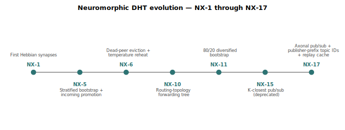

<span class="muted">Eight generations of design iteration, each addressing one concrete failure mode
observed in the previous generation.</span>

---

## NH-1 — five operations, one vitality model

NX-17 has **~36 organically-grown rules** and **44 tunable parameters**.
NH-1 collapses every rule into one of five operations, scored by a unified vitality function.

| Operation | Behaviour |
|---|---|
| **NAVIGATE** | AP routing + 2-hop lookahead + iterative fallback |
| **LEARN** | LTP, hop caching, triadic closure, incoming promotion |
| **FORGET** | Continuous decay + vitality-based eviction |
| **EXPLORE** | Temperature annealing + epsilon-greedy first hop |
| **STRUCTURE** | Stratified bootstrap + under-represented replacement |

```
vitality(syn) = weight × recency
```

A single `_addByVitality()` admission gate replaces stratified eviction, two-tier
highway management, stratum floors, and synaptome floors. **~270 new lines**, **12
parameters** — including the full NX-17-style AxonManager pub/sub stack.

---

## NH-1 vs NX-17 (25,000 nodes, web-limited)

| Test | NX-17 | NH-1 | Δ |
|---|---:|---:|---:|
| Global lookup | 4.36 hops / 237 ms | 5.14 hops / 260 ms | +18% h / +10% ms |
| 500 km lookup | 2.76 hops / 81 ms | 3.35 hops / 97 ms | +21% / +20% |
| **10%→10% hot lane** | **1.06 hops / 32 ms** | **1.12 hops / 34 ms** | **+6% / +5%** |
| **pubsubm delivered** | **100%** | **100%** | **TIE** |
| **pubsubm + 5% churn recovered** | **100%** | **98%** | **−2pp** |
| K-overlap (pub↔sub) | 100% | 99.6% | −0.4pp |
| dead-children / orphans | 0 / 0 | 0 / 0 | TIE |

<span class="callout">Without the connection cap (server-class), NH-1 essentially **ties**
NX-17 across every metric. The residual capped gap reflects NX-17's specialised
rules earning their keep when the per-node connection budget is tight.</span>

---

## Simulator integrity (v0.66)

The numbers in this deck are produced under three explicit invariants:

1. **Bilateral connection cap honestly enforced.** Every node respects `connections.size ≤ 100`. A base-class guard rail (`DHT.verifyConnectionCap`) runs at post-init, post-warmup, and after every churn round; a console `[CAP VIOLATION]` is impossible to miss.

2. **Locality preserved.** No optimisation reads another node's routing table directly. Each node's `findKClosest` runs independently using only its own state, mirroring what a real WebRTC client could observe.

3. **Bounded RPC responses.** `findKClosest` simulates real Kademlia FIND_NODE with peer responses bounded to `k`=20, not full routing-table dumps. Earlier versions inflated candidate pools 5–10× by reading peer memory directly.

<span class="muted">All three were enforced retroactively across NX-15 / NX-17 / NH-1
between v0.66.04 and v0.66.07. Pre-v0.66 churn benchmarks for NX-17 were superseded —
the simulator was previously letting NX-17's nodes exceed the cap by up to 14× during
churn rounds. The numbers in this deck are post-fix.</span>

---

## References

- **Whitepaper** — `Neuromorphic-DHT-Architecture.md` v0.66 (this repository)
- **Source + data** — <code>github.com/YZ-social/dht-sim</code>

<br>

### Related work

- Maymounkov & Mazières · *Kademlia: A Peer-to-peer Information System Based on the XOR Metric* (2002)
- Rowstron & Druschel · *Pastry* (2001); Zhao et al · *Tapestry* (2001)
- Watts & Strogatz · *Collective Dynamics of Small-World Networks* (Nature, 1998)
- Hebb · *The Organization of Behavior* (1949)
- Google · *S2 Geometry Library* (2011)

---

<!-- _class: title -->

# Questions

<br>

<span class="muted">Whitepaper, source, and all benchmark CSVs are in the repo.
Every number in this deck is reproducible from <code>results/*.csv</code>.</span>
