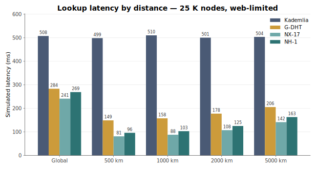
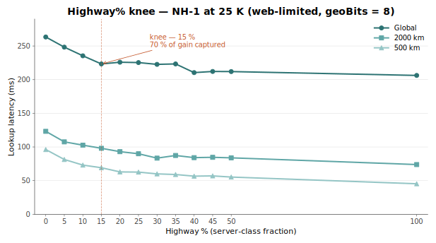

<!-- _class: title -->

# Neuromorphic DHT — NH-1

## A Learning-Adaptive Distributed Hash Table
## with Axonal Publish-Subscribe

<br>

*Research brief · 25 K-node benchmark*

<br>

**David A Smith** · [YZ.social](https://YZ.social)
davidasmith@gmail.com

<br>

<span class="muted">Source, data, and simulator: <code>github.com/YZ-social/dht-sim</code></span>

---

## Why?

> *"Those who would give up essential Liberty, to purchase a little temporary Safety, deserve neither Liberty nor Safety."* — Benjamin Franklin

<br>

**Privacy and security are not in tension.** That framing is a lie, and it is a lie on purpose.

**Privacy is the precondition for freedom.** A person who can be watched cannot dissent. A person whose every word passes through a custodian does not have a private thought. A person whose identity, location, and associations are legible to power is not free — they are *permitted*.

**Governments want surveillance because surveillance is state power.** **Corporations want surveillance because surveillance is the product.** Neither wants freedom. Both have learned to call compliance "safety."

**Encryption over a watching network is not enough.** We need a network that *cannot watch*, by intention.

<span class="callout">The DHT is the minimum viable substrate. Without it, every "decentralized" service is one trusted server away from being centralized again — and every promise of privacy is provisional on the custodian's current ideology.</span>

---

## What is a DHT? Why we need them

A **distributed hash table** is the foundation for finding *anything* in a decentralized network: any node, given a key, can locate the value in O(log N) hops with **no central authority, no privileged peer, no trusted coordinator**.

**Already in production at scale:**

| System | Year | Built on |
|---|---:|---|
| BitTorrent Mainline DHT | 2005+ | Kademlia variant — millions of simultaneous nodes |
| Ethereum devp2p | 2015+ | Modified Kademlia — peer discovery for blockchain consensus |
| IPFS / libp2p | 2015+ | Kademlia + content routing — CID → provider mapping |
| Mastodon / ActivityPub | 2016+ | Federation-level peer discovery |
| Coral DSHT | 2004 | Latency-aware proximity clusters (research predecessor) |
| S/Kademlia | 2007 | Security-hardened Kademlia (sibling broadcast, disjoint paths) |

**Why we *desperately* need the next generation now:**

Centralized platforms have become single points of surveillance, censorship, and outage. Secure communication can no longer assume a trustworthy intermediate. Sovereignty over identity, location, and routing requires a substrate that **no one party can compromise**.

<span class="callout">A DHT is the minimum viable substrate. Without it, every "decentralized" service is one trusted server away from being centralized again.</span>

---

## The Neuromorphic DHT — how it differs

Traditional DHTs (Kademlia, Pastry, Tapestry) treat the routing table as a **static data structure**: fixed buckets, one rule for replacement, no awareness of the traffic flowing through. They were designed in 2001-2002 for stable nodes — and they do not adapt to the network they live in.

The **Neuromorphic DHT** treats every peer as a *synapse*: a learnable edge with a weight that grows with successful traffic and decays without it. Routing consults those weights. Eviction picks the least-vital edge. The table changes as the network changes.

| | Traditional DHT | Neuromorphic DHT |
|---|---|---|
| Routing table | Fixed K-bucket per stratum | Weighted synaptome |
| Edge state | Live / dead | Weight ∈ [0, 1], recency, locked-on-use |
| Routing decision | Greedy XOR | Action Potential (XOR × weight × latency) |
| Adapts to traffic? | No | Yes — Long-Term Potentiation (**LTP**), triadic closure, hop caching |
| Adapts to churn? | Lazy bucket refresh | Active dead-peer eviction + temperature reheat |
| Pub/sub | Layered on top | Integrated as axonal delivery trees |

<br>

The trade is "fixed and analytical" → "adaptive and empirical". The whitepaper-correctness of K-buckets gives way to *measured* behavior — which is why the rest of this talk is about measurement.

---

## Pub/sub belongs in the network

**The end-to-end argument** (Saltzer, Reed, Clark, 1984): functions that can be implemented at the endpoints should be implemented at the endpoints. Put nothing in the network that doesn't *have* to be there.

**Pub/sub routing has to be there.** A subscriber and a publisher cannot, end-to-end, discover the multicast paths that connect them — only the network can. Treating pub/sub as a separate "application overlay" forces it to reproduce the routing layer with no actual visibility into it. The end-to-end principle applies to *meaning*; **delivery is a network function**.

**A decentralized DHT is the right place for it.** Every node is *both* an endpoint and a relay. The mechanism is content-blind: it routes bytes toward a topic, with no inspection and no control over what travels.

<br>

**Consequences:**
- **Everyone becomes a broadcaster** — peer-symmetric, no privileged position, no central authority.
- The network is **not smart**. It has no control over the information it carries.
- It is a **protocol and a platform** for relaying that information.
- It is **hyper-connected**, within the physical limits of a phone or a browser.

<br>

<span class="callout">This is the architectural commitment NH-1 inherits from the start. The whole DHT exists to make this delivery primitive viable.</span>

---

## Why a simulator

The environment our system runs on is **the Internet**.

We have attempted to build as fair and realistic environment simulation as we could. The interface and services it provides to system components will be identical to those of an actual deployed system.

**This matters because** after launch there is no easy way to monitor, repair or improve the network we deployed. By design we *can't*. The only honest path is a simulated Internet large enough for us to have a reasonable expectation of *verisimilitude* to study.

**And everyone can see it.** Source, data, every CSV in this deck — all open.

<br>

<span class="callout">"As close to the actual system as possible" does not mean *good*. It means: this is what we have right now. We will continue improving it.</span>

<span class="muted">Why do we do this? Because we *can't* track how information flows through the real system. We can't understand it — much less figure out how to repair it or improve it — without the ability to simulate it.</span>

---

## The lab bench


Purpose-built simulator · ~25 K lines of JavaScript · open-source.

**Modeled with fidelity**
- GeoJSON land mask; haversine distances
- Up to 50 000 nodes on a navigable 3-D globe
- Per-hop simulated latency including 10 ms transit cost
- Bilateral connection caps mirroring WebRTC (Web Real-Time Communication) limits
- Every hop, ACK, reroute captured

**Abstracted**
- No wall-clock transport or encryption
- In-process node identity

**Reproducibility**
- All protocols build from the *same* seeded node set
- CSV export per run — every number in this deck is from <code>results/*.csv</code>

---

## Naming as compact vocabulary

Four terms from neuroscience, each mapping to a specific data structure.

| Term | Maps to |
|---|---|
| **Synapse** | One directed *outgoing* routing edge with a learned weight ∈ [0, 1] |
| **Synaptome** | The full set of outgoing synapses at a node — bounded at **50** |
| **Neuron** | A node: synaptome + temperature + message handlers |
| **Axon** | A directed delivery tree for one pub/sub topic, grown by routed subscribe |

<br>

The vocabulary is descriptive, not metaphorical. Every term has one and only one corresponding artifact in the source code.

<span class="muted">**Capacity note.** 50 is the cap on *outgoing* synapses. The total bilateral connection budget per node is **100** peers (≈ 50 outgoing + 50 inbound) — chosen as a safe cross-browser WebRTC target. Both numbers are pragmatic: they match the practical ceiling of a typical browser, but the precise split is somewhat arbitrary.</span>

---

## Protocols we will examine

We benchmark four DHTs at 25 K nodes under identical conditions. Each builds on its predecessor:

| Protocol | What it adds | Inherits from |
|---|---|---|
| **K-DHT** (Kademlia, 2002) | XOR distance metric, K-buckets, α-parallel lookup | — |
| **G-DHT** (geographic) | S2 cell prefix in node IDs ⇒ regional locality | K-DHT |
| **NX-17** (predecessor state of the art, **SOTA**) | 18 specialized rules, peak performance under tight cap | G-DHT *(via NX-1 … NX-15)* |
| **NH-1** (this work, 2026) | Vitality-driven synaptome, unified admission gate | **NX-17** *(consolidation)* |

<br>

NH-1 is *not* a fresh parallel design — it is the result of a careful analysis of NX-17 and every protocol before it. Each NX-17 rule was studied for what it does, why it was added, and whether its work could be folded into a smaller surface area.

- **NX-17** carries the lineage: 18 specialized rules, 44 parameters, ~2300 lines.
- **NH-1** consolidates that lineage: 12 rules, 12 parameters, ~270 lines — every admission decision through a single vitality score.

<br>

<span class="callout">We selected NH-1 as the deployment target for its **maintainability and understandability**. We continue to use NX-17 as the reference benchmark — the bar that NH-1 should approach, and that future work should match or surpass.</span>

---

## K-DHT — Kademlia, the foundation

**Distance metric:** XOR — `d(a, b) = a ⊕ b`
**Routing table:** Every node maintains K peers per bucket. Lookup is a greedy walk toward the target in XOR distance, with α=3 parallel queries and K=20.
**Properties:** O(log N) hops in steady state. Static, predictable, analyzable.

<br>

| Limit | Evidence at 25 K |
|---|---|
| No locality awareness | 500 km lookup = **510 ms** — identical to its 499 ms global lookup |
| Fixed buckets | Same K peers regardless of usefulness; no response to traffic |
| Lazy churn repair | Broken edges persist until next bucket refresh |
| Broadcast cost O(audience) | Each pub/sub recipient reached by an independent lookup |

<br>

<span class="muted">K-buckets were a 2002 answer to "what's a stable routing table?" — static, predictable, analyzable. We will argue that adaptive weighting does better in practice.</span>

<span class="callout">The data structure is frozen. The network is not.</span>

---

## G-DHT — adding geographic locality

**The change:** `nodeId = S2 cell prefix (8 bits) ‖ H(publicKey)`.

XOR in the ID space now approximates XOR in physical distance — the prefix dominates. Same K-bucket routing as Kademlia, no other changes.

<br>

**Result at 25 K:**
- 500 km regional latency: 510 ms → **150 ms** (3.4× faster)
- Global latency: 498 ms → **287 ms**

<br>

But still a *static* routing algorithm. No learning. No dynamics. The geographic prefix is a one-time topology decision, not an ongoing adaptation. Pub/sub is still bolted on top via K-closest replication, which drifts under churn.

---

## The S2 library — what the cell prefix actually is


**S2 (Google, 2011)** is a hierarchical decomposition of the sphere onto a Hilbert space-filling curve, projected through six cube faces. Every point on Earth maps to a 64-bit cell ID; every prefix length defines a successively coarser tile.

- **Top 8 bits** — face + a few subdivisions. ≈ **256 tiles** worldwide, each ≈ **continent-scale** (e.g. "western North America", "South-East Asia"). This is what we embed in every node ID.
- **Hilbert curve property** — geographically adjacent points have numerically close cell IDs. XOR distance in ID space ≈ physical distance, *for free*.
- **Sub-cell hierarchy** — refining the prefix bit-by-bit subdivides the tile in half along the Hilbert curve. 30 bits ≈ city block; 40+ bits ≈ metres.

<span class="callout">S2 gives us **locality for free** — at the cost of trusting that nodes don't lie about where they are.</span>

---

## S2 — security implications

The S2 prefix in a node ID is **self-declared**. A node can claim any prefix it wants. This has three consequences:

- **The S2 prefix is not a trust primitive.** Never use it for authorisation, regional permissions, or anything resembling a capability check.
- **Prefix-forgery is real.** A malicious actor can pick a prefix to land in a different region. The benign failure mode is degraded routing (mis-located peers misroute traffic). The adversarial failure mode is a **Sybil swarm** in a target cell — many forged identities clustering on one region's address space.
- **Proof-of-location is the obvious defense.** Verifiable round-trip time (**RTT**) triangulation, GPS attestation, or trusted-witness schemes could anchor a claimed prefix to a measurable physical reality. This remains future work.

<br>

<span class="muted">The honest framing: today's locality is a *cooperative* primitive. It works because well-behaved peers don't lie. The protocol does not depend on the prefix being honest, but its locality benefits do — and an attacker can degrade them without affecting correctness.</span>

---

## G-DHT — locality at a glance


<span class="muted">Lookup latency by distance, web-limited 25 K. G-DHT's geographic prefix gives regional traffic a 3-4× speedup over Kademlia. Global lookups still pay the full hop cost.</span>

---

## NH-1 — our chosen design

**The change:** every peer becomes a *synapse* with a learnable weight. The routing table is no longer fixed K-buckets — it is a **synaptome** that adapts to traffic, prunes by vitality, and grows via learning rules (LTP, triadic closure, hop caching).

**The architectural arc:**
- **Inherits** the entire NX lineage (NX-1 → NX-17): K-DHT's XOR metric, G-DHT's geographic prefix, NX-17's AP routing, LTP, triadic closure, hop caching, axonal pub/sub
- **Consolidates** five separate admission mechanisms (stratified eviction, two-tier highway, stratum floors, synaptome floors, adaptive decay) into a single vitality gate
- **Removes** rules whose contribution didn't measurably justify their parameter footprint
- **Keeps** every behavioral surface that NX-17 measurably needed

<br>

**Design priority: simplicity.**

| | NX-17 | **NH-1** |
|---|---:|---:|
| Rules | 18 | **12** |
| Parameters | 44 | **12** |
| Lines of code | ~2300 | **~270** |
| Admission gate | 5 mechanisms (stratified eviction, two-tier, stratum floors, synaptome floors, adaptive decay) | **1** (`_addByVitality`) |

<br>

<span class="callout">We accept a small performance gap against NX-17 in exchange for an architecture that one engineer can hold in their head — and that future engineers can extend without archeology.</span>

---

## NX-17 — the reference

**Two research generations led here.**

**Launch pad: N-1 → N-15W.** The original neuromorphic DHT family — fifteen-plus variants — explored the design space: synapses with weights, activation potentials, simulated annealing, hop caching, lateral spread, dendritic relay trees. Each pushed on one mechanism and exposed two new failure modes. By N-15W we had a working but tangled protocol with too many entangled rules to refactor in place.

**Focused iteration: NX-1 → NX-17.** The NX series re-grounded the architecture from a clean base. Each generation (NX-1, NX-2W, NX-3, … NX-17) addressed *one* concrete failure observed in its predecessor — one rule at a time, each measured against a benchmark. **NX-17 is the result.**

<br>

NX-17 is *better* than NH-1 under tight connection caps:

| Test (25 K, cap=100) | NX-17 | NH-1 | Δ |
|---|---:|---:|---:|
| Global lookup | **4.40 hops / 242 ms** | 5.15 / 263 ms | +9 % ms |
| 500 km lookup | **2.75 / 80 ms** | 3.28 / 95 ms | +18 % ms |

But it carries 18 specialized rules, 44 parameters, and ~2300 lines. Each rule earned its keep against a measured failure mode. Together they form a system hard to understand and hard to extend.

<br>

<span class="callout">We use NX-17 as the **reference benchmark**. The full rule list — and NH-1's disposition for each — appears later in this deck.</span>

---

## NH-1 in one slide — five operations, one vitality model

NH-1 collapses the entire protocol into **five operations**, each scored by a unified vitality function.

| Operation | What it does |
|---|---|
| **NAVIGATE** | Action Potential (**AP**) routing + 2-hop lookahead + iterative fallback |
| **LEARN** | LTP, hop caching, triadic closure, incoming promotion |
| **FORGET** | Continuous decay + vitality-based eviction |
| **EXPLORE** | Temperature annealing + epsilon-greedy first hop |
| **STRUCTURE** | Stratified bootstrap + mixed-capacity (highway) deployment |

<br>

```
vitality(syn) = weight × recency
```

A single `_addByVitality()` admission gate replaces stratified eviction, two-tier highway management, stratum floors, synaptome floors, and adaptive decay. **~12 parameters** end-to-end.

---

## What we call vitality

NH-1 admits and evicts every synapse via one scalar:

```
vitality(syn) = weight × recency(syn)
```

**weight** ∈ [0, 1] — trained by Long-Term Potentiation; reinforced on successful routing paths; decayed each tick by `γ = 0.995`.

**recency** = `exp(−Δepoch / RECENCY_HALF_LIFE)`. Two parameters control the time scale, both in NH-1's 12-parameter budget:
- **`INERTIA_DURATION = 20` epochs** — after a reinforcement, recency is locked to 1.0 for 20 lookups. This is the LTP protection window: a freshly used synapse cannot be evicted, regardless of vitality competition. Below this, learning would be self-destructive — the system would discard the very edges it just discovered to be useful.
- **`RECENCY_HALF_LIFE = 50` epochs** — once the inertia window expires, recency decays exponentially with a half-life of 50 lookups. After ~150 lookups with no reinforcement, recency is below 0.13 and the synapse is highly evictable.

<br>

The two factors are conventional individually. Hebbian potentiation (Hebb, 1949) gives the weight; exponential decay since last use (Ebbinghaus, 1885; LRU-K caching, O'Neil 1993) gives the recency. The closest biological analog is **synaptic tagging and capture** (Frey & Morris, *Nature* 1997) — synapses with both recent activity *and* sufficient potentiation are preferentially retained.

<br>

<span class="callout">The contribution of NH-1 is *not* the term or the formula. It is the use of this product as a **single admission gate** replacing five specialized mechanisms in NX-17: stratified eviction, two-tier highway management, stratum floors, synaptome floors, and adaptive decay.</span>

---

## NH-1 rules — the full set, by operation

| # | Rule | Operation | Why this rule |
|---|---|---|---|
| 1 | Stratified bootstrap | STRUCTURE | Cold-start coverage across all XOR distances |
| 2 | Mixed-capacity (highway%) | STRUCTURE | Realistic deployment — some peers run on real servers |
| 3 | AP routing | NAVIGATE | Learned-weight greedy walk dominates pure XOR |
| 4 | Two-hop lookahead | NAVIGATE | One probe of α second-hop options unblocks dead ends |
| 5 | Iterative fallback | NAVIGATE | If no progress, expand to k-closest from the synaptome |
| 6 | Long-Term Potentiation | LEARN | Reinforce edges on successful paths |
| 7 | Triadic closure | LEARN | If A→B→C succeeds twice, learn A→C |
| 8 | Hop caching | LEARN | Intermediate nodes cache the path for the destination |
| 9 | Incoming promotion | LEARN | Peers that contact me often become outbound synapses |
| 10 | Vitality-based eviction | FORGET | Drop the least-vital synapse when capacity is reached |
| 11 | Temperature annealing | EXPLORE | Cool exploration rate over time; reheat on dead-peer discovery |
| 12 | Epsilon-greedy first hop | EXPLORE | Small probability of random first hop avoids local minima |

<span class="muted">Every rule has a measured contribution at 25 K nodes. Ablations in Appendix C of the whitepaper.</span>

---

## STRUCTURE — bootstrap and deployment realism

**Stratified bootstrap.** Each new node is seeded with peers covering all XOR strata uniformly. Without this, the cold-start synaptome is dominated by lucky neighbors — local hops form, long hops don't.

**Mixed-capacity deployment ("highway %").** Real P2P networks are heterogeneous: most peers are browsers (WebRTC ~100 connections), some are server-class (effectively unlimited).

A configurable `highwayPct` fraction of nodes is promoted to **server-class**: they accept unlimited inbound, hold a synaptome of up to 256, and act as transit hubs. The rest stay browser-class with the standard 50-synapse cap.

<br>

<span class="callout">15 % highway nodes captures **70 % of the available latency improvement** over the all-browser baseline (chart later in this deck).</span>

---

## NAVIGATE — Action Potential routing

Each hop, score every candidate by a learned function:

```
AP(syn, target) = progress(syn, target) × syn.weight × ½^(latency_ms / 100)
```

- **progress** = XOR distance reduction toward target
- **weight** = LTP-reinforced [0, 1]
- **latency penalty** = exponential — fast peers preferred at all distances

<br>

**Two-hop lookahead.** When no first-hop is decisively best, probe for the best second-hop candidates and pick the path with the highest combined score.

**Iterative fallback.** If AP returns no candidate (every neighbor is "wrong direction"), fall back to k-closest-from-synaptome and retry. This rescues lookups that would otherwise stall in dead corridors.

---

## LEARN — four reinforcement mechanisms

**LTP (Long-Term Potentiation).** When a lookup succeeds, every synapse on the successful path gets a weight bump and an inertia lock. Locked synapses cannot be evicted.

**Triadic closure.** When a node X observes peer A repeatedly routing through it to peer C, X introduces A directly to C. A gains a new synapse to C; X is no longer needed as middleman on future A → C lookups. The name comes from social-network theory: the open triangle A — X — C is *closed* into a direct A — C edge.

**Hop caching.** Each intermediate node on a successful lookup adds the *destination* to its synaptome. The path becomes shorter on the next lookup to the same region.

**Incoming promotion.** When a peer reaches out to me repeatedly via incoming synapses, I promote it to a real outbound synapse — passive learning of who's interested in me.

---

## FORGET — the unified admission gate

`_addByVitality(node, newSyn)` is called for *every* synapse addition: bootstrap, LTP, triadic, promotion, hop caching, annealing.

```
1. If synaptome has room → add.
2. Otherwise, find the lowest-vitality non-locked synapse.
3. If new synapse's vitality > victim's → swap.
4. Else → refuse silently.
```

<br>

This single function replaces:
- NX-17's stratified eviction
- NX-17's two-tier (synaptome + highway) management
- NX-17's stratum floors
- NX-17's synaptome floors
- NX-17's adaptive decay parameters

<br>

<span class="callout">Continuous decay (γ = 0.995/tick) erodes weight uniformly. Under-used synapses lose vitality and become eligible for replacement; well-used ones stay locked.</span>

---

## EXPLORE — temperature and epsilon

**Temperature annealing.** Each node carries a temperature `T ∈ [T_min, T_init]`. Cool by `T *= 0.9997` each lookup. Higher T → more probabilistic synapse selection (Boltzmann-style); lower T → greedy AP scoring.

**Reheat on dead-peer discovery.** When routing finds a dead peer, spike `T = max(T, 0.5)`. Accelerates exploration to repair damage.

**Epsilon-greedy first hop.** With probability ε = 0.05, replace the first AP-selected hop with a random synaptome member. Cheap insurance against early lock-in to a suboptimal corridor.

<br>

<span class="muted">Both exploration mechanisms are biased toward learning rather than fully random — the floor is uniform sampling over the *current synaptome*, not over the network.</span>

---

## What pub/sub on a DHT must do

Five requirements — the rest of this section is the answer to each.

| # | Requirement | Why hard on a DHT | NH-1's answer |
|---:|---|---|---|
| 1 | **Reliable delivery** at steady state | A naïve broadcast = N independent lookups → O(N²) cost | Routed axonal tree, fan-out via direct sends |
| 2 | **Churn resilience** | K-closest sets drift; publisher/subscriber views diverge | Routed re-subscribe; tree heals on every refresh |
| 3 | **Deterministic routing** | Subscriber & publisher must agree on the same root without negotiation | Publisher-prefix topic ID — both derive it offline |
| 4 | **ID stability** | Topic identity can't change as the membership churns | `topicId = publisher.cellPrefix(8b) ‖ hash₅₆(name)` — fixed at publisher's S2 cell |
| 5 | **Recovery from missed messages** | Subscribers reconnecting want history, not just future messages | Bounded replay cache at every relay; replay piggy-backs on subscribe |

<span class="callout">The NH-1 pub/sub stack is a direct, point-by-point response to these five constraints. The next four slides show the mechanism for each.</span>

---

## How we got here — the K-closest → Axonal tree journey

The current design wasn't the first try. The route through three failed approaches earned the architecture:

- **NX-15 — K-closest replication.** Subscribe stores at each of K=5 nodes closest to `hash(topic)`; publish hits any one. Worked at zero churn but suffered a structural failure under load: publisher and subscribers compute `findKClosest` from *different positions* in the network, so under churn their top-K sets drift apart. Delivery collapsed to ~38 % at 25 % churn — not a routing bug, a *coordination* bug.
- **NX-16 — masked-distance fix attempt.** Tried to decouple K-closest selection from synaptome expansion by masking the geographic prefix in the distance metric. Routing collapsed to ~40 % delivery *even at zero churn*. The lesson, archived as a cautionary example: **the distance metric used to select candidates must match the gradient used to expand them.**
- **NX-17 — pure axonal tree, four targeted fixes:**
  1. **Publisher-prefix topic IDs** so publisher and subscribers derive the same root deterministically — no negotiation, no drift.
  2. **Terminal globality check** — when greedy routing thinks it's reached the topic, it does one `findKClosest(topicId, 1)` to confirm no globally-closer peer exists. Without this, two subscribers can elect different roots.
  3. **External-peer batch adoption on overflow** — when an axon hits its capacity, it picks a *synaptome peer* (not an existing child) as the new sub-axon and ships the appropriate subscribers in one batch. Two invariants prevent runaway recursion.
  4. **All-axon periodic re-subscribe** — every role re-issues its subscribe. The re-subscribe *is* the liveness check; no separate ping, no parent tracking.

<span class="callout">The architecture you're about to see (next slides) is the *fourth* attempt. The earlier three each fixed a real failure mode; each one introduced a new one. The current design is what's left when you stop adding parts.</span>

---

## Pub/sub on top — axonal trees

**Why the name?** In a biological neuron, the **axon** is the *output* projection — a single fibre that branches, branches again, and finally synapses onto many downstream targets. Information flows *outward* from one source to many recipients along this branching tree. That is exactly the shape of a healthy publisher-to-subscribers fan-out.

**The analogy is structural, not poetic.** A pub/sub topic in NH-1 is rooted at one node (the topic's "soma"). Direct subscribers attach to the root; when the root has too many children, it delegates a sub-axon (a "branch") that takes over a subset of the subscribers. The tree grows toward the population that wants the topic — just as a real axon grows toward its targets during development.

---

## Axonal trees — how they work

**Topic identity (deterministic).** `topicId = publisher.cellPrefix(8b) ‖ hash₅₆(event_name)`. Both publisher and every subscriber derive the same 64-bit ID with no negotiation. The tree's root pins into the publisher's S2 cell — naturally close to its audience.

**Subscribe is a routed message** toward `topicId`. The first live axon role encountered on the path *intercepts* and adds the new subscriber to its children. If the walk completes with no axon found, the terminal node opens a new role and becomes the **root**. Every subscribe message also carries the subscriber's `lastSeenTs` and triggers a replay (covered on the next slide).

**Publish** goes through the same route to `topicId`, lands at the root, and then **fans out**: the root sends to its direct children; each axon sub-role recursively forwards to its own children. One DHT lookup, then pure tree forwarding.

**Branching on overflow (batch adoption).** When an axon's direct-child count exceeds `maxDirectSubs`, it picks an existing peer in its synaptome as a new sub-axon, partitions its current children by XOR proximity to that new sub-axon, and hands off the relevant batch in one `ADOPT_SUBSCRIBERS` message. The tree branches in O(1) DHT operations.

**Self-healing via re-subscribe.** Every role re-issues its subscribe on a 10-second refresh interval. The walk lands on whichever live axon is closest to `topicId` *now*. Parent died? The re-subscribe attaches to a different live ancestor. Tree got reorganized? Invisible to the subscriber. The re-subscribe **is** the liveness check — there is no separate ping.

<br>

<span class="callout">100 % delivery baseline; **100 % recovered delivery** under 5 % churn at 25 K nodes.</span>

---

## Temporal pub/sub — subscribe is a request for *history*

A subscribe is not just "send me future messages on this topic". It is **"send me every message I haven't already seen"**. Each subscribe carries a `lastSeenTs` — the highest publish timestamp this subscriber has observed.

**Every relay node keeps a bounded ring buffer.** When an axon role receives a publish, it records `{ json, publishId, publishTs }` in a local cache (capacity ≈ 100 messages — tunable per topic).

**On subscribe arrival, the relay filters its cache to `publishTs > lastSeenTs` and replays the missed messages as a single batched message** before forwarding the subscribe upstream.

<br>

**Why this matters under churn:**

The decentralized axon tree means every re-publish node — not just the publisher — holds a copy of recent history. If a parent dies and a subscriber's re-subscribe lands on a different live relay, that new relay can fill the gap from *its own* cache. **Healing and replay are the same mechanism.** No central log, no separate recovery remote-procedure call (**RPC**), no "catch-up" protocol.

<br>

<span class="callout">A subscribe message in NH-1 is simultaneously a liveness probe, a tree-attach request, and a request for missed history. Three jobs, one envelope — that's the axonal healing model.</span>

---

## End-to-end tick

```
on lookup(target):
  hop = 0
  while hop < MAX_HOPS:
    candidates = synaptome ∪ incomingSynapses
    next       = AP_score(candidates, target)
    if next == null: next = iterative_fallback(target)
    if hop == 0 and rand() < ε: next = random(synaptome)

    record_transit(prev, next)         // LEARN: triadic
    promote_incoming_if_warranted()    // LEARN: incoming
    hop_cache_destination()            // LEARN: hop caching
    anneal_replace_lowest_vitality()   // EXPLORE
    hop++

on success: reinforce_path()           // LEARN: LTP
periodically: decay_all_weights()      // FORGET
```

Every operation cost is bounded: O(synaptome.size). At 50 synapses the per-hop compute is ~0.2 ms — small relative to the 10 ms transit cost.

---

## Methodology

- **500 lookups per test cell.** Global, regional radii (500 / 1k / 2k / 5k km), pub/sub
- **Same node geometry** across all four protocols — direct comparison, not three independent builds
- **Bootstrap init** for production realism: sponsor-chain join + warmup. Omniscient init shown separately as a theoretical ceiling.
- **Churn** induced discretely (instantaneous kill) and continuously (1 % every 5 ticks)
- **Connection cap** 100 (browser-class, web-limited model)

<br>

<span class="callout">Every number in the next section comes from a single 25 K-node CSV captured at simulator v0.67.02. The footer's current version reflects code revisions to the diagnostic pipeline since then; the underlying routing data is unchanged.</span>

---

## What training does — and doesn't do

A non-obvious result from running every NX variant under two starting conditions:

- **Omniscient init** — every node seeded with its theoretically optimal K-closest neighbors
- **Bootstrap init** — sponsor-chain join + 50 K warmup lookups (production realism)

| Protocol | Omniscient hops | Bootstrap-trained hops | Gap | Bootstrap success% |
|---|---:|---:|---:|---:|
| N-1 | 2.22 | 5.10 | +130 % | **60 %** ❌ |
| NX-3 | 3.64 | 4.33 | +19 % | 73 % ❌ |
| NX-6 | 3.61 | 4.43 | +23 % | **100 %** |
| NX-10 | 3.67 | 4.29 | +17 % | 100 % |
| NX-15 | 3.47 | 4.30 | +24 % | 100 % |
| **NX-17** | **3.67** | **4.28** | **+17 %** | **100 %** |

<br>

**Three findings:**

1. **A shared asymptote.** Every NX from NX-6 onward lands in a tight 4.28 – 4.43 hop band under bootstrap+training, *regardless* of where it started. Training settles the synaptome to a **traffic-driven asymptote** near 4.3 hops, essentially independent of initial conditions.
2. **NX-17 has the smallest hop gap and fast bootstrap-trained latency.** Bootstrap-trained NX-17 evaluates greedy candidates faster than its own omniscient configuration: pruned synaptomes are leaner. (Latency is left as hops × per-hop cost in this table — the 4-way comparison earlier in the deck reports the headline NX-17 latency at the 25 K, default-warmup configuration.)
3. **Training is compute-optimizing, not path-shortening.** The 50-synapse cap is the binding constraint. Training redistributes weight on the edges sponsor-chains gave you at join — *it does not discover new shorter edges sponsor-chains missed*.

<span class="callout">The lever for production routing quality is the **initial synaptome construction**, not the training algorithm. Bootstrap-trained NX-17 hits a 4.3-hop asymptote at 100 % success — competitive with its own omniscient ceiling.</span>

<span class="muted">Numbers in this table are from a controlled multi-variant ablation (50 K warmup lookups). The 4-way comparison earlier in the deck reports NX-17 at default warmup conditions and is the canonical headline latency.</span>

---

## Four-way comparison at 25,000 nodes

<span class="muted">Web-limited (cap = 100), omniscient init, geoBits = 8, no highway promotion. Same node geometry across all four protocols. **Canonical init**: every protocol uses identical K-closest XOR-fill bootstrap so the routing/learning algorithm is measured in isolation from any per-protocol bootstrap strategy.</span>

| Test | Kademlia | G-DHT | NX-17 | **NH-1** |
|---|---:|---:|---:|---:|
| Global (hops / ms) | 4.53 / **508** | 5.57 / 284 | 4.47 / **241** | 5.26 / 269 |
| 500 km (hops / ms) | 4.50 / 499 | 4.86 / 149 | 2.79 / **81** | 3.30 / 96 |
| 1000 km (hops / ms) | 4.58 / 510 | 5.04 / 158 | 2.97 / **88** | 3.49 / 103 |
| 2000 km (hops / ms) | 4.45 / 501 | 5.36 / 178 | 3.36 / **108** | 3.96 / 125 |
| 5000 km (hops / ms) | 4.49 / 504 | 5.44 / 206 | 3.74 / **142** | 4.50 / 163 |
| pubsubm delivered | n/a | n/a | **100 %** | **100 %** |
| pubsubm + 5 % churn (recovered) | n/a | n/a | **100 %** | **100 %** |
| dead-children / orphans | n/a | n/a | **0 / 0** | **0 / 0** |

<br>

<span class="callout">Both NX-17 and NH-1 dominate Kademlia and G-DHT on every distance band. NX-17 retains a small lead at the cap = 100 ceiling — see "NH-1 vs NX-17" later in this deck.</span>

<span class="muted">Native-init numbers (each protocol's own bootstrap strategy) sit within 5–10 ms of these on a per-cell basis; the 4-way ranking is identical. Canonical init is the headline measurement because it removes bootstrap variance from the algorithmic claim.</span>

---

## Four-way comparison — at a glance



<span class="muted">Lookup latency (ms) per distance band, 25 K nodes web-limited. NX-17 (light teal) and NH-1 (deep teal) cluster well below Kademlia (slate) and G-DHT (amber) at every distance.</span>

---

## Highway %: deployment-realistic knee

**What this slide measures.** Real P2P networks are heterogeneous: most participants run inside a browser (~50–100 connections, the WebRTC ceiling), but some run on real servers with effectively unlimited inbound capacity. We sweep the *fraction* of server-class nodes from 0 → 100 % and measure NH-1 latency at each point.

**What "highway" means.** A **highway node** is a server-class peer: `maxConnections = ∞`, synaptome cap raised from 50 to 256. It accepts unlimited inbound and acts as a transit hub. The rest of the network stays browser-class.

**Highway promotion within the simulator is random** — no privileged coordinator picks them. In a real deployment, highway status is *self-determined*: a peer running as a node application on a PC or a server identifies itself as one based on its actual capacity. The protocol treats highway and browser nodes identically apart from their cap.

**What the "knee" means.** The point on the curve where additional server-class capacity stops paying off — adding more highway nodes beyond the knee yields rapidly diminishing latency improvement. It is the cheapest deployment that captures most of the available benefit.

<br>

| Highway % | Global hops / ms | 500 km ms | 2000 km ms | Synaptome (highway) |
|---:|---:|---:|---:|---:|
| 0 (all browser) | 5.09 / 263 | 96 | 123 | n/a |
| 5 | 4.61 / 248 | 81 | 108 | 217 |
| **15 (knee)** | **4.16 / 223** | **69** | **98** | **218** |
| 30 | 3.97 / 223 | 60 | 83 | 215 |
| 50 | 3.76 / 212 | 55 | 84 | 208 |
| 100 (all server) | 3.52 / 206 | 45 | 74 | 244 |

<br>

<span class="callout">**15 % highway captures 70 % of available improvement** — a realistic deployment scenario where some peers run on powerful hardware.</span>

<span class="muted">The hw = 0 row reads 5.09 / 263 ms; the headline 4-way comparison earlier in the deck reads NH-1 at 5.15 / 263 ms. Same configuration, two different runs — within run-to-run noise. Each table is consistent within itself.</span>

---

## Highway %: the knee, charted



<span class="muted">Three latency curves (global, 2000 km, 500 km) across the highway% sweep. The knee at 15 % is highlighted. Beyond 50 %, the system is essentially saturated — it has the routing it can use.</span>

---

## Slice World — recovery from a network partition

The Slice World test partitions the network into Eastern and Western hemispheres connected through **a single bridge node** (placed near Hawaii). Every cross-hemisphere edge except those incident on the bridge is removed.

**The question it asks** is not *"can you find the bridge once?"* — it is *"given **one** intact connection across a severed network, can the protocol leverage that single hole in the dike into a flood of restored connectivity?"*

| Protocol | Slice success% | Slice hops / ms | What happens |
|---|---:|---:|---|
| Kademlia | **0.0 %** ❌ | — | Cannot reach the bridge. The partition is permanent — the network is now two networks. |
| G-DHT | **4.6 %** ❌ | 9.5 / 525 | Same limitation; the geographic prefix doesn't help when no edge points at the bridge |
| NX-17 | **94.8 %** | 7.3 / 423 | Bridge becomes the seed; learning amplifies it into recovered connectivity |
| **NH-1** | **94.4 %** | 8.7 / 462 | Same mechanism; consolidation costs nothing here |

<span class="callout">A partition like this is what a real outage looks like — a submarine cable fault, an ISP-level filter, a regulatory split. The test measures whether the protocol can **heal** from it.</span>

---

## Slice World — the bridge as a seed crystal

A diagnostic run shows the recovery happening directly. Starting from a freshly partitioned 5 K network — **zero cross-hemisphere synapses, partition honest** — and running just 10 lookups:

| | value |
|---|---:|
| Cross-hem synapses **before** | 0 |
| Cross-hem synapses **after 10 lookups** | **20** |
| Lookups that succeeded | 7 / 10 |
| Avg new cross-hem synapses per success | ~3 |

**Each successful bridge crossing seeds new connectivity.** When a path goes `west-source → … → bridge → … → east-target`, NH-1's learning rules fire on every node along the way:

- **`_hopCache`** — every intermediate node adds the *destination* to its synaptome (a fresh cross-hem edge for every west node on the path)
- **`_recordTransit`** — observed `(prev → next)` pairs become triadic-closure candidates
- **`lateralSpread`** — propagates the new synapse to the source's geographic neighbors

**By 500 lookups, the partition has effectively dissolved.** Hundreds of cross-hem synapses now exist; only the earliest lookups depended exclusively on the bridge. The 95 % aggregate success rate is the *integral* of recovery, not a snapshot of bridge-finding.

<span class="callout">**This is what the test was designed to measure.** Single-shot bridge-finding is the opening move; learning-driven re-stitching is the play. NH-1 doesn't route through the partition — it *dissolves* it.</span>

---

## Pub/sub robustness

| Metric | NH-1 at 25 K |
|---|---:|
| Baseline delivery | 100.0 % |
| Immediate (post-kill, no refresh) | 99.9 % |
| **Recovered (after 3 refresh rounds)** | **100.0 %** |
| K-overlap (publisher / subscriber views) | 99.5 % |
| K-set stability (recovered, pub / sub) | 95 % / 95 % |
| Dead-children | 0 |
| Orphans | 0 |
| Attached % | 100 % |

<br>

<span class="muted">Same numbers across the entire highway% sweep — pub/sub robustness is independent of capacity asymmetry.</span>

<span class="callout">The axonal tree heals through **routed re-subscribe**. There is no separate liveness ping, no parent tracking, no gossip.</span>

---

## Pub/sub under sustained churn — graceful degradation, no cliff

A continuous live-simulation: 25 K nodes, 79 groups × 32 subscribers, **1 % of alive non-publisher nodes killed every 5 ticks**, three refresh passes between kills. Cumulative churn measured as fraction of original network replaced.

| Cumulative churn | Delivered % | K-overlap | Axon roles |
|---:|---:|---:|---:|
| 0 % | **100.0 %** | 100 % | 537 |
| 5 % | 98.7 % | — | 1,541 |
| 10 % | 91.2 % | 81 % | 1,787 |
| 15 % | 88.7 % | 77 % | 1,989 |
| 20 % | 86.5 % | 62 % | 2,116 |
| 25 % | 70.0 % | 54 % | 2,169 |
| 30 % | 52.4 % | 47 % | 2,189 |
| 34 % | 50.8 % | 42 % | 2,197 |

<br>

**Three observations:**

1. **No cliff.** Delivery degrades smoothly with churn; there is no breakdown threshold. The system finds a steady state where new subscriber recruitment matches loss.
2. **K-overlap predicts delivery 1:1.** The dominant residual failure isn't broken routing — it's subscribers temporarily captured at relay nodes that have lost their delivery path to the root. The replay cache (next slide *"Temporal pub/sub"*) was designed to close exactly this gap.
3. **Axon-role count grows with churn but plateaus.** From 537 axons at 0 % churn to ~2,200 at 30 %, leveling off. The tree absorbs growth into deeper structure rather than unbounded fan-out.

<span class="callout">**Through 20 % cumulative churn, NH-1 holds delivery above 86 % with no replication, no gossip, and no parent tracking.** Above 25 % churn the protocol enters a recovery-paced regime where steady-state delivery is the equilibrium of recruitment vs. loss.</span>

---

## Honesty: locality vs. latency

**N-DHT's priorities are speed and robustness** — fast lookup, reliable delivery. Geographic location is *not a goal*; it is one input.

**What the simulator does.** Every protocol's hop latency is computed from physical (haversine) distance between simulated nodes — a faithful Internet model. This is what the real Internet looks like to all four protocols.

**What the protocol does.** A node knows *only its own* S2 cell — embedded once, at creation, into the top of its 64-bit ID:

```
nodeId = S2 cell prefix (8 bits) ‖ H(publicKey)
```

The protocol cannot ask another node *"where are you?"* — there is no such message. The S2 prefix creates **initial regional clustering at bootstrap** because nearby nodes are XOR-close, so a node's K-bucket and synaptome are seeded with mostly-local peers. After that, locality is a derived property of the routes that LTP and vitality reinforce.

**Latency is used in routing**, indirectly: AP scoring includes a `½^(latency_ms/100)` penalty, so observed round-trip time (**RTT**) influences hop selection. Fast peers win at every distance — that is the speed-first priority in action.

---

## The geoBits = 0 ablation

When we strip the S2 prefix and re-run, regional latency collapses:

| Test | geoBits = 8 | **geoBits = 0** | Δ |
|---|---:|---:|---:|
| Global | 5.09 / 263 ms | 5.94 / 453 ms | +72 % |
| 500 km | 3.31 / 96 ms | **6.01 / 444 ms** | **+363 %** |
| 2000 km | 3.93 / 123 ms | 6.01 / 437 ms | +255 % |
| 5000 km | 4.54 / 169 ms¹ | 5.96 / 433 ms | +156 % |

<span class="muted">¹ The geoBits = 8 baseline at 5000 km is from the headline 4-way comparison run (which measured all five distance bands). The geoBits = 0 sweep run measured 5000 km natively; the geoBits = 8 run in the same sweep skipped 5000 km for time. Numbers are from comparable 25 K, hw = 0 conditions but distinct CSVs.</span>

<br>

The latency penalty in AP routing is not strong enough, on its own, to discover locality from scratch within standard warmup (~5000 lookups). The S2 prefix is the **bootstrap shortcut**: it does not *teach* locality, it *seeds* the network with locality so reinforcement can sharpen routing within it.

<br>

<span class="callout">Geography is an initial-condition shortcut for the latency optimization, not a goal in itself. Future work: an embedded RTT-coordinate system (Vivaldi-style) could replace the S2 seed with a learned one — see the comparison slide later in this deck.</span>

---

## geoBits = 0 — isolating the learning advantage

If we strip the S2 prefix from *every* protocol simultaneously — and use **canonical init** so each protocol starts from the identical K-closest-XOR routing table — the comparative picture isolates exactly the routing/learning algorithm.

<span class="muted">25 K nodes, web-limited (cap = 100), omniscient init, **geoBits = 0**, **canonical init**.</span>

| Protocol | Global ms | 500 km ms | 2000 km ms | Notes |
|---|---:|---:|---:|---|
| Kademlia | **506** | 511 | 504 | Pure XOR routing; no learning, no locality. |
| G-DHT | **780** | 765 | 781 | Despite identical bootstrap, **still slower than K-DHT** — the gap is **not** bootstrap, it's G-DHT's `noProgressLimit = 3` (vs K-DHT's 2). An extra "no progress" round per lookup is wasted overhead at geoBits=0. |
| **NX-17** | **376** | **341** | **355** | Beats Kademlia by **26 %** with identical start and no geographic structure. Pure learning advantage. |
| NH-1 | 467 | 418 | 439 | Beats Kademlia by **8 %**. Same learning chassis, simpler — pays a measurable consolidation cost vs NX-17. |

<br>

**Three findings:**

1. **NX-17 and NH-1 still beat Kademlia under identical bootstrap and no locality.** This is the cleanest possible "learning helps" claim — every confound (bootstrap strategy, geographic prefix) controlled. NX-17 wins by 26 %, NH-1 by 8 %.
2. **G-DHT vs K-DHT exposes a non-bootstrap difference.** Canonical init equalizes bootstrap; the residual 780-vs-506 gap comes from G-DHT's lookup-tuning choice (`noProgressLimit = 3`), tuned for geographic-routing escapes that don't exist at geoBits = 0. A real architectural finding the methodology surfaced.
3. **NH-1 vs NX-17 narrows but doesn't close.** The 80/20 supplement helped NX-17 by ~7 ms at geoBits=8 (native vs canonical). At geoBits=0 the 376-vs-467 gap is roughly 24 % — it's NX-17's specialized rules, not its bootstrap, doing the work.

<span class="callout">**The headline gap is real and measurable.** NX-17 at 376 ms vs Kademlia at 506 ms, identical starting state, no locality, no geography — that is what the routing/learning algorithm contributes. Removing that distance from the deck would be hiding the actual claim.</span>

---

## Init mode × geoBits — the full 2 × 2

Global lookup latency in milliseconds. **Canonical** = every protocol starts from K-closest-XOR (identical state). **Native** = each protocol's own bootstrap strategy (Kademlia: pure XOR; G-DHT: 50/50 stratified+random; NX-17: 80/20; NH-1: pure XOR).

<span class="muted">25 K nodes, web-limited (cap = 100), omniscient init, hw = 0.</span>

| | Kademlia | G-DHT | NX-17 | NH-1 |
|---|---:|---:|---:|---:|
| **geoBits = 8 · native** | 488 | 289 | **234** | 254 |
| **geoBits = 8 · canonical** | 508 | 284 | 241 | 269 |
| **geoBits = 0 · native** | 493 | 769 | 377 | 461 |
| **geoBits = 0 · canonical** | 506 | 780 | **376** | 467 |

<br>

**Three things this 2 × 2 makes visible:**

- **Bootstrap matters less than people often assume.** Native vs canonical at geoBits = 8 swings each protocol by under 8 %. The architectural choices are real but small relative to other effects.
- **The geographic prefix matters a lot — for everyone.** Geo = 8 to geo = 0 doubles K-DHT-equivalent latency. The S2 prefix is doing real work in every column. Removing it forces every protocol to route under genuinely random IDs.
- **Learning matters most under stress.** At geoBits = 0 / canonical (the hardest condition for routing), NX-17 is 26 % faster than Kademlia and NH-1 is 8 % faster. Under easier conditions (geoBits = 8) the gap widens further. **The advantage scales with how much there is to learn.**

<span class="callout">Canonical-init isolates the routing/learning algorithm. Native-init measures the protocol as deployed. Both are real; both belong in the record. The deck headlines canonical because it's the cleaner architectural claim.</span>

---

## N-1 → NH-1 — three phases of research

| Phase | Generation | Contribution |
|---|---|---|
| **Exploration** | N-1 | First neuromorphic DHT — Hebbian synapse weighting, action-potential routing, two-hop lookahead |
|  | N-15W | Renewal-Based Highway Protection — last protocol of the original lineage before the restart |
| **Focused iteration** | NX-1 | Clean, configurable restart of the architecture from a fresh base |
|  | NX-4 | **Watershed**: iterative fallback — every protocol below fails under stress, every protocol at or above succeeds |
|  | NX-6 | Churn-resilience baseline: dead-synapse eviction, temperature reheat, adaptive decay |
|  | NX-10 | Routing-topology forwarding tree — the first stable axonal-style pub/sub |
|  | NX-11 | Diversified bootstrap — the 80 / 20 stratified + random allocation that NX-17 inherits |
|  | NX-15 | `AxonManager` generic membership protocol with K-closest replication |
|  | NX-17 | Publisher-prefix topic IDs + pure routed axonal tree (no replication, no gossip) |
| **Consolidation** | **NH-1** | Vitality-driven unified admission gate — consolidates 18 specialized rules into 12; ~270 lines vs NX-17's ~2300 |

<br>

<span class="callout">**NX-16: a cautionary dead end.** NX-16 attempted to decouple `findKClosest`'s target cell from the node-ID prefix by masking the top 8 bits in the distance metric. Routing collapsed: publisher and subscribers found *different* "closest" nodes for the same topic; delivery dropped to ~40 % even at zero churn. The lesson: **the distance metric used to select candidates must match the gradient used to expand them.** Archived, not deleted — design failures earn their place in the record.</span>

---

## NX-17 rules and their NH-1 disposition

| NX-17 rule | What it does | NH-1 status |
|---|---|---|
| Stratified bootstrap | Cold-start coverage across XOR strata | **Kept** (STRUCTURE) |
| Diversified bootstrap (80/20) | 20 % random peers for global reach | **Kept** (merged into bootstrap) |
| Two-tier synaptome (50 + highway) | Separate "permanent" + "candidate" tiers | **Replaced** by per-node `_maxSynaptome` |
| Stratified eviction | Evict from over-represented stratum | **Replaced** by vitality eviction |
| Stratum floors | Guarantee min peers per stratum | **Removed** — vitality + diversity penalty handles it |
| Synaptome floor | Refuse eviction below N peers | **Removed** — vitality preserves locked entries |
| AP routing | Learned-weight greedy walk | **Kept** (NAVIGATE) |
| Two-hop lookahead | Probe second-hop alternatives | **Kept** (NAVIGATE) |
| Epsilon-greedy first hop | Random first hop with prob ε | **Kept** (EXPLORE) |
| Iterative fallback | k-closest fallback when AP fails | **Kept** (NAVIGATE) |
| LTP | Reinforce successful paths | **Kept** (LEARN) |
| Hop caching + lateral spread | Cache destination on intermediates | **Kept** (LEARN) |
| Triadic closure | Learn long edges from transit | **Kept** (LEARN) |
| Incoming promotion | Promote popular incoming peers | **Kept** (LEARN) |
| Adaptive decay | Per-node decay rate based on usage | **Default off** — flat γ = 0.995 wins |
| Simulated annealing | Replace lowest-vitality with 2-hop sample | **Kept** (EXPLORE) |
| Churn recovery (dead-syn eviction) | Drop dead peers on discovery | **Kept** (FORGET) |
| Temperature reheat on death | Spike T after dead-peer discovery | **Kept** (EXPLORE) |
| Diversity budget penalty | Penalise over-represented stratum groups | **Removed** v0.65.06 (harmful) |
| weightScale parameter | Bias AP scoring toward LTP weight | **Removed** v0.66.10 (no measurable effect) |

<span class="muted">~18 rules + 5 retired parameters → 12 active rules in NH-1. Behavioral surface is the same; admission logic is unified.</span>

---

## NH-1 vs NX-17 — and why

| Test | NX-17 | **NH-1** | Δ (NH-1 vs NX-17) |
|---|---:|---:|---:|
| Global | 4.40 hops / 242 ms | 5.15 hops / 263 ms | +17 % hops, +9 % ms |
| 500 km | 2.75 / 80 ms | 3.28 / 95 ms | +19 % hops, +18 % ms |
| 2000 km | 3.27 / 105 ms | 4.01 / 126 ms | +23 % hops, +20 % ms |
| 5000 km | 3.74 / 143 ms | 4.54 / 169 ms | +21 % hops, +18 % ms |
| pubsubm delivered | 100 % | 100 % | tie |
| pubsubm + 5 % churn (recovered) | 100 % | 100 % | tie |
| dead-children / orphans | 0 / 0 | 0 / 0 | tie |

<br>

The residual gap reflects two things:

**1. NX-17's specialized eviction policies are tuned for the cap=100 case.** Stratified eviction with stratum and synaptome floors *guarantees* a coverage profile that NH-1's vitality eviction approximates but doesn't pin. Under tight caps, that difference is measurable.

**2. NH-1 trades peak performance for simplicity.** ~270 lines vs NX-17's ~2300; 12 parameters vs ~44. The point is not that NH-1 is *faster* — it's that NH-1 is *almost as fast* with one unified admission gate that's easier to reason about and easier to extend.

<br>

<span class="callout">Highway% recovers the gap and more — at hw=15 % NH-1 is **223 ms global**, beating NX-17's all-browser 242 ms. The capped gap is the cost of consolidation. We accept it.</span>

---

## What is Coral DSHT?

**Coral** (Freedman, Freudenthal, Mazières — NSDI 2004) is a **distributed sloppy hash table** that powered Coral CDN — one of the earliest production decentralized content-distribution networks. Coral coined the term *DSHT* to distinguish itself from strict DHTs.

**Mechanism — hierarchical RTT clusters.** Each node measures round-trip time to every other node it encounters and joins **multiple nested clusters** at increasing RTT thresholds (e.g. < 20 ms, < 60 ms, global). Each cluster runs its own internal DHT.

**Lookup is local-first.** When a node queries a key, it first searches the tightest cluster it belongs to. If no result is found there, it expands outward to the next cluster, and so on. Most queries terminate in the local cluster — cross-cluster fan-out happens only when necessary.

**"Sloppy" semantics.** The strict DHT promise — *one canonical XOR-closest node per key* — is deliberately relaxed. A key may be stored at *any* node in the lookup cluster, and queries return the *first* hit, not the canonical one. This is what makes Coral a CDN: the same content is replicated at many local nodes, and clients pull from the nearest available.

**Production deployments:** Coral CDN (2004 – ~2015) — handled millions of cache requests per day at peak, served as a free CDN for academic and small-publisher sites.

<span class="callout">**For this project:** Coral's hierarchical-cluster idea is *parallel* to NH-1's weighted-synaptome approach. Both achieve latency-aware routing; they make very different structural commitments to get there.</span>

---

## Coral vs N-DHT

Both adapt to network latency. They make opposite structural choices.

| Aspect | Coral DSHT | N-DHT |
|---|---|---|
| **Structure** | Multiple nested DHTs, one per RTT cluster | A single flat synaptome with weighted edges |
| **Locality discovery** | Active RTT measurement at join + cluster membership | Passive — observed traffic reinforces useful edges; S2 prefix seeds initial regional bias |
| **Storage semantics** | *Sloppy* — multiple replicas per key, return-first-found | *Strict* — one canonical XOR-closest node per key |
| **Lookup** | Local cluster first, escalate outward only if needed | Single greedy AP walk over weighted synaptome |
| **Adaptation** | Cluster boundaries are static thresholds; nodes move between clusters | Continuous: weights update on every successful path |
| **Designed for** | Read-heavy content distribution (CDN) — many readers, mostly-static content | Routing + pub/sub — dynamic membership, real-time delivery |
| **Pub/sub support** | Out of scope | First-class via axonal trees |

<br>

**Where they overlap:** both reject the "one fixed routing structure for all distances" approach. Both treat geographic locality as a property to *exploit*, not just record.

**Where they differ:** Coral *enforces* locality through the hierarchical cluster structure — every node *knows* what's near. N-DHT *learns* locality through usage — every node *discovers* what's near via routed traffic. Coral relaxes the DHT promise to be local-first; N-DHT preserves the strict DHT promise and learns shortcuts on top.

<span class="callout">Coral's design choice was: "give up the canonical mapping to win locality." NH-1's design choice was: "keep the canonical mapping; make locality emerge from learning." Different engineering trade-offs against the same core problem.</span>

---

## What is Vivaldi?

**Vivaldi** (Dabek, Cox, Kaashoek, Morris — SIGCOMM 2004) is a **decentralized network coordinate system**. Each node continuously adjusts a synthetic position vector — typically in 3-dimensional Euclidean space plus a small "height" component — so that the *Euclidean distance* between any two nodes' coordinates approximates the *measured round-trip time* between them.

**Mechanism.** Each node starts at a random position. Whenever it exchanges traffic with a peer, it observes the actual RTT, then applies a small spring-force adjustment to its own coordinate — pulling toward or pushing away from that peer to better match observation. Confidence in each measurement weights the magnitude of the move. Over many such observations, the system converges to a stable configuration where pair-wise Euclidean distances ≈ pair-wise RTTs.

**What it accomplishes.** Any node can *predict* RTT to any peer it has never directly measured, purely from coordinates. Routing layers (or applications) can then choose "nearby" peers without an active probe round — Vivaldi turns latency into a queryable global property of the network. The system is fully decentralized: no coordinator, no infrastructure, no synchronization.

**Production deployments:** Coral CDN, Azureus / Vuze (BitTorrent), some content-addressable overlays. The most influential predecessor for *latency-aware* peer-to-peer design.

<span class="callout">**For this project:** a Vivaldi-style coordinate system is a candidate for replacing NH-1's *structural* S2 prefix with a *learned* locality primitive. Future benchmarks may include a Vivaldi-style protocol for completeness — both as a comparison reference and as a forward-looking direction.</span>

---

## Vivaldi vs N-DHT

Both are adaptive routing systems. They optimize different things.

| Aspect | Vivaldi | N-DHT |
|---|---|---|
| **Mechanism** | Synthetic coordinates in N-D Euclidean space | Hebbian reinforcement on routing edges |
| **What's learned** | A position vector per node that predicts RTT to any peer | A weight per synapse, reinforced by traffic on successful paths |
| **Output** | RTT prediction (any pair) | A ranked list of next-hops (per lookup) |
| **Locality discovery** | Emergent from RTT measurements | Imposed via S2 cell ID prefix |
| **Convergence guarantee** | Yes — coordinate descent on RTT residuals | Empirical — depends on traffic mixing |
| **Layered separation** | Coordinate system is generic; any routing layer can use it | Routing and learning are integrated in a single protocol |
| **Pub/sub support** | Out of scope — Vivaldi is a primitive | First-class — axonal tree built on routed synaptome |

<br>

**Where they overlap:** both treat the network as something to *measure and adapt to*, not a fixed topology to traverse.

**Where they differ:** Vivaldi predicts RTT, then any routing layer uses those predictions. N-DHT learns *paths* via reinforcement on the routing layer itself — locality is built into the IDs, learning sharpens the path within that locality.

---

## Simulator integrity

Five invariants govern every measurement in this deck: **(1)** the bilateral connection cap is honestly enforced (a base-class guard rail audits `connections.size ≤ maxConnections` at post-init, post-warmup, and after every churn round); **(2)** locality is preserved — no optimization reads another node's routing table directly; **(3)** RPC responses are bounded to k=20 peers, the envelope a real WebRTC node could actually return; **(4)** per-protocol parameters reach the protocol they were configured for, with no silent defaults; **(5)** the geographic prefix width is a runtime parameter that flows into every protocol's node-ID construction, including the `geoBits = 0` ablation runs.

<br>

<span class="callout">**Every invariant on this list has been violated at least once during development.** The deck shows post-fix measurements only. Skepticism is the methodology, not a hindrance.</span>

---

## Message protocol

**Two layers.** The application sees exactly two messages — SEND and RECEIVE. Everything else is the lower-level p2p wire protocol that implements them.

<br>

**Application layer** — what an application built on NH-1 actually calls:

| Message | Purpose |
|---|---|
| **SEND** (target, payload) | Deliver a message toward a target — node, key, or topic |
| **RECEIVE** (handler) | Register to receive messages addressed here, or to a topic this node subscribes to |

<br>

**P2P wire layer** — the messages NH-1 exchanges between peers to make SEND / RECEIVE work. Application code never constructs these directly.

| Message | Purpose |
|---|---|
| PING / PONG | Liveness |
| FIND_NODE | DHT lookup step |
| ROUTE | Routed message toward a key (subscribe, publish, generic SEND) |
| SUBSCRIBE / UNSUBSCRIBE | Pub/sub membership; carries `lastSeenTs` for replay |
| PUBLISH | Publish to topic |
| DIRECT_DELIVER, ADOPT_SUBSCRIBERS, REPLAY_BATCH | Axonal pub/sub specifics |

<br>

**Common envelope** (every wire message): version, type, sender, signature, timestamp, nonce, payload. Routing is **stateless in the protocol**. All state lives per-node: synaptome + axon roles.

---

## Deployment considerations

- **Trust model.** No central authority. Public-key signatures authenticate peers.
- **Sybil resistance.** S2 cell prefix lightly discourages sybil swarms per-cell — not a full defense. Proof-of-location or a proof-of-work (**PoW**) join hurdle recommended for open deployments.
- **Provisioning.** Bootstrap via a small published sponsor set; fully decentralized thereafter.
- **Observability.** Nodes export local stats (synaptome health, LTP rate, role counts) for operator overlays.

---

## Pub/sub failure modes we can name

Honest accounting of where the axonal tree shows seams:

- **Forwarder loss under churn.** When a tree-internal node dies mid-publish, its subtree is briefly unreachable until each member's next refresh. Today: each affected node's periodic re-subscribe routes to whichever live axon is now closest to `topicId` and re-attaches there — no explicit subtree move, the tree heals at the speed of the refresh interval. *Possible:* redundant forwarders or proactive health checks to shorten the gap.
- **Tree rebuild cost at scale.** O(S × F) for S subscribers and F forwarders. Negligible at 2 K subscribers; measurable at 50 K+. *Possible:* incremental updates rather than full rebuilds.
- **Gateway concentration.** A skewed synaptome can yield deep-narrow trees instead of broad-shallow ones. Today: recursive delegation distributes load. *Possible:* secondary splitting on geographic cell when one gateway covers > 50 % of remaining children.
- **Synaptome–tree coupling.** Annealing replacing a synapse that's also a forwarder leaves a stale tree until TTL. *Possible:* mark tree dirty on synapse eviction.
- **Byzantine resistance.** The system assumes honest nodes. *Possible:* proof-of-location, cryptographic ID binding, reputation, multi-path verification.

<br>

<span class="muted">Every item above is documented in Chapter 7 of the whitepaper with current mitigation and a candidate fix. None are blockers for the headline workloads in this deck — but each is a named, measurable failure mode the architecture should answer for in the next iteration.</span>

---

## Limitations and future directions

**Known limitations**
- **Warmup dependency.** N-DHT needs ~5 000 lookups before the synaptome converges. The first minute of deployment is suboptimal.
- **Synaptome capacity bounded at 50.** A deliberate cross-browser target. Server deployments could use 200–500.
- **Locality requires geographic IDs.** Without S2 prefix, regional locality collapses. *(Vivaldi-style RTT-only locality is future work.)*
- **Training is compute-optimizing, not path-shortening.** Cannot close the bootstrap → omniscient hop gap without changes to bootstrap or annealing.
- **Memory & bandwidth overhead.** ~50 synapses × ~80 B metadata ≈ 4 KB / node + axonal-tree state per subscribed topic. Modest, but worth measuring at 50 K+ subscribers.

**Future directions**
- **RTT-driven locality (Vivaldi integration).** Today's locality is structural; an embedded coordinate system could drive locality without a geo-prefix.
- **Adaptive synaptome capacity.** Bump capacity during join-heavy periods; prune in steady state.
- **Global-pool annealing.** Periodically replace the lowest-vitality synapse with a *globally-sampled* candidate rather than a 2-hop sample — closes the bootstrap → omniscient gap.
- **Larger-scale evaluation.** 100 K / 250 K / 1 M nodes. Preliminary 50 K data exists; larger runs need server-side simulation.
- **Proof-of-location.** The S2 prefix is self-declared today. A verifiable location primitive would prevent prefix forgery.

---

## Key takeaways

1. **NH-1 collapses ~18 NX-17 rules into 12 rules organised under 5 operations.** A single vitality function — `weight × recency` — drives every admission decision.

2. **15 % server-class nodes (highway%) captures 70 % of the available latency improvement.** Realistic deployment doesn't need a uniform server fleet.

3. **Pub/sub on routed axonal trees: 100 % baseline, 100 % recovered delivery under 5 % churn.** No K-closest replication, no gossip, no parent tracking — just routed re-subscribe.

4. **The simulator catches its own bugs.** Skepticism — "if it looks too good to be true, it is" — has saved this deck from at least three retracted findings during this session.

5. **Locality in NH-1 is structural (S2 prefix), not learned.** This is honest, comparable, and a pointed direction for future work (Vivaldi-style coordinate systems).

---

## References

**Whitepaper** — `documents/Neuromorphic-DHT-Architecture.md` (this repository, v0.67)
**Source + data** — <code>github.com/YZ-social/dht-sim</code>

<br>

### Architecture
- Saltzer, Reed, Clark · *End-to-End Arguments in System Design* (ACM TOCS 1984) — function placement principle
- Clark · *The Design Philosophy of the DARPA Internet Protocols* (SIGCOMM 1988)

### Foundational DHT work
- Maymounkov & Mazières · *Kademlia: A Peer-to-peer Information System Based on the XOR Metric* (IPTPS 2002)
- Rowstron & Druschel · *Pastry: Scalable, decentralized object location and routing* (Middleware 2001)
- Zhao et al. · *Tapestry: A Resilient Global-Scale Overlay* (IEEE J-SAC 2004)

### Latency-aware DHTs
- Freedman, Mazières · *Sloppy Hashing and Self-Organizing Clusters* (IPTPS 2003) — the Coral DSHT design
- Freedman, Freudenthal, Mazières · ***Democratizing Content Publication with Coral*** (NSDI 2004) — Coral CDN deployment

### Adaptive coordinates
- Dabek, Cox, Kaashoek, Morris · ***Vivaldi: A Decentralized Network Coordinate System*** (SIGCOMM 2004)
- Cox, Dabek, Kaashoek, Li, Morris · *Practical, Distributed Network Coordinates* (HotNets 2003)
- Ledlie, Gardner, Seltzer · *Network Coordinates in the Wild* (NSDI 2007)

### Substrate (learning, decay, pruning)
- Hebb · *The Organization of Behavior* (1949) — synaptic potentiation
- Ebbinghaus · *Über das Gedächtnis* (1885) — exponential forgetting curve
- Frey & Morris · *Synaptic tagging and the late phase of LTP* (Nature 1997) — biological analog of weight × recency retention
- LeCun, Denker, Solla · *Optimal Brain Damage* (NeurIPS 1989) — prune lowest-magnitude connections
- O'Neil, O'Neil, Weikum · *The LRU-K Page Replacement Algorithm* (SIGMOD 1993) — multi-history recency for cache replacement
- Watts & Strogatz · *Collective Dynamics of Small-World Networks* (Nature 1998)
- Google · *S2 Geometry Library* (2011) — <https://s2geometry.io/>
